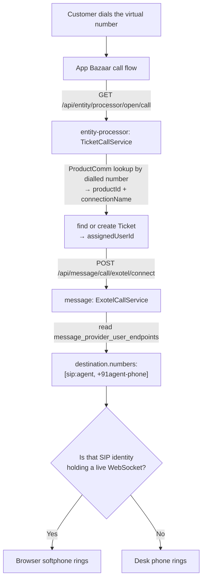
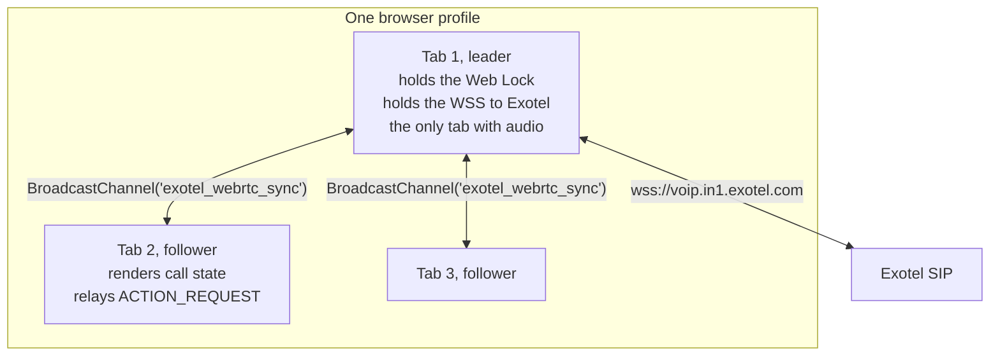
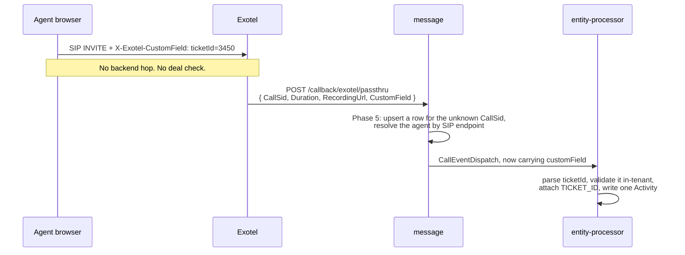

# Exotel WebRTC CRM Telephony: End-to-End Guide (v2, validated)

> **Vendor:** Exotel
> **Model:** CRM-owned UI, Exotel WebRTC SDK (`crmBundle.js`), backed by the `message` and
> `entity-processor` services
> **Target app:** leadzump

**v2 changes:** checked against the code on `feature/whatsapp2`. Seven claims in v1 were wrong,
including one that described a feature that does not exist, and eight pieces of frontend and
platform work were missing. Corrections are marked `[CORRECTED]`, new work `[GAP]`.

> Companion document:
> [exotel_webRTC_Backend_implementation_plan.md](exotel_webRTC_Backend_implementation_plan.md)
> is the backend plan. Read its Section 0 first: this guide depends on backend phases that do not
> exist yet.

---

## Table of Contents

- [0. Read this first](#0-read-this-first)
- [1. Core concept: IP-PSTN intermix](#1-core-concept-ip-pstn-intermix)
- [2. Credentials and connection configuration](#2-credentials-and-connection-configuration)
- [3. Platform prerequisites](#3-platform-prerequisites)
  - [3.1 App-level CSP](#31-app-level-csp-gap-u1)
  - [3.2 Permissions-Policy and secure context](#32-permissions-policy-and-secure-context-gap-u2)
  - [3.3 Hosting the SDK bundle](#33-hosting-the-sdk-bundle)
- [4. Backend API sequence](#4-backend-api-sequence)
- [5. Multi-tab synchronization](#5-multi-tab-synchronization-corrected-u3)
- [6. Inbound call flow](#6-inbound-call-flow)
- [7. Outbound calling and ticket attribution](#7-outbound-calling-and-ticket-attribution-corrected-u4)
- [8. The Softphone component](#8-the-softphone-component-decision-supersedes-u5)
- [9. UIEngine call functions](#9-uiengine-call-functions-decision)
- [10. Token lifetime](#10-token-lifetime-gap-u6)
- [11. Troubleshooting](#11-troubleshooting)
- [12. Work checklist](#12-work-checklist)

---

## 0. Read this first

### Corrections to v1

| # | v1 said | Reality |
|---|---------|---------|
| U4 | "`entity-processor` extracts `ticketId=3450` and logs an Activity directly into the ticket timeline" | **None of that chain exists.** `message` parses `CustomField` and then drops it: it is not on `CallEventDispatch`, not on `CallEventRequest`, and `TicketCallLogService.fromEvent()` never reads it. See [Section 7](#7-outbound-calling-and-ticket-attribution-corrected-u4) |
| U7 | Outbound WebRTC calls get logged via the passthru webhook | They do not. `processPassThruCallback` returns 404 for a `CallSid` it has never seen, and a browser-placed call is never in `message_exotel_calls`. Backend Phase 5 is a hard prerequisite |
| U3 | "Our frontend manager elects one leader tab" | Script 1 in v1 elects nothing. Every tab calls `initExotelSoftphone` and every tab registers its own SIP session, which is the exact problem the section says it solves. See [Section 5](#5-multi-tab-synchronization-corrected-u3) |
| U8 | Setup and provision curls carry only `appCode` and `clientCode` | Both routes are authenticated. As written they return 401. See [Section 4](#4-backend-api-sequence) |
| U9 | Inbound webhook is `GET /api/entity/processor/open/call`, connection resolved from the request | The path is right. The connection comes from **`ProductComm` keyed on the dialled virtual number**, which is why the virtual number must be registered against a product before any of this works |
| U10 | Migration is `V20__Create_Call_Provider_Tables.sql` | V20 to V23 are taken. It is **V24** |
| U11 | Real credentials, tokens and a colleague's account details were inline in the document | Removed. Two of those tokens are live Exotel account credentials. See [Section 2](#2-credentials-and-connection-configuration) |

### Gaps

| # | Gap | Section |
|---|-----|---------|
| U1 | App-level CSP was never mentioned. Without it the SDK will not load and the WebSocket will not open. Resolving it also settled the architecture: **no `'unsafe-eval'`**, because the softphone ships as a platform component with UIEngine functions and never touches `ExecuteJSFunction`. leadzump's live CSP grants no eval and should not start | [3.1](#31-app-level-csp-gap-u1) |
| U2 | `Permissions-Policy` for the microphone, and the secure-context requirement | [3.2](#32-permissions-policy-and-secure-context-gap-u2) |
| U3 | Leader election is described but not implemented. Now lives in the softphone module singleton, not in page script | [5](#5-multi-tab-synchronization-corrected-u3) |
| U5 | No supported way to write a call event into the page store. Superseded: a component has `setData` and `runEvent`, so the marker-button trick and the proposed `globalThis.modlixSetData` are both dropped | [8](#8-the-softphone-component-decision-supersedes-u5) |
| U6 | Token refresh. 24h expiry against a CRM tab that stays open for days | [10](#10-token-lifetime-gap-u6) |
| U12 | No way for the UI to know whether the logged-in user is provisioned, so the phone button would show for everyone | [4](#4-backend-api-sequence) |
| U13 | Deprovisioning is not in any offboarding flow | [12](#12-work-checklist) |
| U14 | No microphone-denied or registration-failed state in the UI | [11](#11-troubleshooting) |

---

## 1. Core concept: IP-PSTN intermix

This part of v1 was correct and is worth keeping.

Exotel's App Bazaar call-flow builder has *Greeting, Connect, Transfer, Voicebot*. It has **no**
"WebRTC user" or "route to browser" applet. Browser routing happens because a `sip:` URI is a valid
entry in the Connect applet's destination list, and Exotel's own integration layer knows which SIP
identities currently hold a live WebSocket.



### Two Exotel-side objects, both required

1. **Integration app**, created through the REST API by backend Phase 3. Binds the virtual number and
   the agent's mobile to an `AppUserId`, and issues the SIP identity.
2. **App Bazaar call flow**, configured by hand in the Exotel dashboard, attached to the **same**
   virtual number, with a Connect applet pointing at our webhook.

Miss either one and the failure is silent in a different way: no integration app means
`/browser/token` fails, no call flow means inbound calls never reach us.

### The dependency v1 left out

`ProductComm` is what turns a dialled number into a connection and a product
(`productCommService.getByPhoneNumber(access, CALL, EXOTEL, callerId)`). If the virtual number is not
registered as a `ProductComm` row for the app, `TicketCallService` throws
`UNKNOWN_EXOTEL_CALLER_ID` and the call drops before any of this runs. Register the number first.

---

## 2. Credentials and connection configuration

**[CORRECTED U11]** v1 had live Exotel `apiKey`, `apiToken`, `customerId` and `customerSecret` inline,
plus a real agent's email, name and mobile number. Those are account-wide credentials for a customer's
Exotel account. Treat them as exposed and rotate them, then keep this document to placeholders.

`Connection` document, `connectionType: CALL`, `connectionSubType: EXOTEL`:

```json
{
  "name": "exotelConnection",
  "connectionType": "CALL",
  "connectionSubType": "EXOTEL",
  "isAppLevel": true,
  "connectionDetails": {
    "accountSid": "<exotel account sid>",
    "apiKey": "<exotel api key>",
    "apiToken": "<exotel api token>",
    "callerId": "<virtual number>",

    "customerId": "<exotel customer id>",
    "customerSecret": "<exotel customer secret>",

    "integrationsBaseUrl": "https://integrationscore.mum1.exotel.com",

    "activate": false,
    "maxRingingDuration": 30
  }
}
```

`activate` is `parallel_ringing.activate`. With `false` the browser rings first and the desk phone
only after `maxRingingDuration`. With `true` both ring at once. This is an open product decision, see
backend plan Section 8.3. Set it deliberately rather than leaving it out.

`telephonyBaseUrl` from v1 is not needed. `createExotelWebClient` uses the `BASE_DOMAIN` constant.

---

## 3. Platform prerequisites

**None of this was in v1, and without it the integration cannot work at all.**

### 3.1 App-level CSP [GAP U1]

CSP is served from the App document's `csp` property, assembled by
`IndexHTMLService.processCSPHeaders`.

**Do not add `'unsafe-eval'`.** An earlier draft of this section said it was mandatory. It is not,
and adding it would be the single worst decision in this project. What follows is the measured
situation and the design that avoids it.

#### What is actually deployed today

leadzump on dev, read off the wire:

```
$ curl -sS -I https://leadzump.dev.modlix.com/ | grep -i content-security-policy
content-security-policy: default-src 'self' 'unsafe-inline' data: https://*.modlix.com ... blob: ...;
                         style-src ...; font-src ...
```

Three things follow from that header:

1. **No `'unsafe-eval'`, and no `script-src`.** `script-src` falls back to `default-src`, which does
   not permit eval. So `new Function` is blocked on leadzump right now.
2. **`ExecuteJSFunction` is therefore broken on leadzump today.** It runs
   `new Function(...args, "return " + name + "(...)")`
   (`nocode-ui/ui-app/client/src/functions/ExecuteJSFunction.ts`, line 37; separate repo, so not
   linked).
   There are 22 uses across three leadzump pages (`plansAndCredits` 7, `testSoftPhone` 9,
   `TestPage` 6) and every one of them fails a CSP check. Worth raising separately from this work.
3. **The CDN host is appended to every directive.** `processCSP` adds `cdnHostName` to each value it
   emits, which is why `cdn-dev.modlix.com` shows up on all three. Account for it when reading the
   header back.

Also correcting an error in the earlier draft: **CSP keys work in either camelCase or kebab-case.**
`processCSP` inserts a hyphen before each uppercase character, so `defaultSrc` becomes `default-src`,
and a key that is already kebab-case has no uppercase characters and passes through untouched.
leadzump uses `default-src` and `style-src`; sitezump uses `defaultSrc` and `styleSrc`. Both work.
Match whichever form the app already uses.

For the record, since it came up: **sitezump's CSP does contain `'unsafe-eval'`**, in `defaultSrc`,
and its Razorpay flow does depend on it. The `buyTokens` page has an `ExecuteJSFunction` step named
`rzpBootstrap` whose `name` parameter is an inline IIFE that loads `checkout.js` and defines
`window.openRazorpayCheckout`. That pattern needs eval. It is not the pattern to copy here.

#### The design that needs no eval

The softphone ships as a **platform component plus UIEngine functions**
([Section 8](#8-the-softphone-component-decision-supersedes-u5),
[Section 9](#9-uiengine-call-functions-decision)). UIEngine functions are invoked by KIRuntime
directly, so nothing on this path calls `ExecuteJSFunction`, nothing calls `new Function`, and
`script-src 'self'` is sufficient.

That also means the component's own code ships inside the client bundle and needs no App-document
entry at all. Two things still load at runtime and are worth being precise about.

**The vendor bundle.** `crmBundle.js` is injected by the provider adapter on first use, from
`/api/files/static/file/SYSTEM/jslib/exotel/`. Same-origin, so `script-src 'self'` covers it. Keeping
it adapter-injected rather than app-declared means it never loads on pages that make no calls, and a
second provider brings its own bundle without touching any app.

**The prototype.** Stage one is a static file, before any of this is a component
([Section 9](#9-uiengine-call-functions-decision) explains why). That does need an App-document entry,
and the platform supports it. `IndexHTMLService` line 349:

```java
processTagType(str, (Map<String, Object>) appProps.get("scripts"), "script", SCRIPT_FIELDS);
```

The `scripts` property emits real `<script>` tags into the head, with these attributes available
(`SCRIPT_FIELDS`, line 50):

```
async, type, crossorigin, defer, integrity, nomodule, referrerpolicy, src
```

```json
{
  "scripts": {
    "exotelSoftphone": {
      "order": 1,
      "src": "/api/files/static/file/SYSTEM/jslib/exotel/softphone-1.0.0.js",
      "defer": "defer",
      "integrity": "sha384-<digest of the file>",
      "crossorigin": "anonymous"
    }
  }
}
```

`integrity` is there, which means **subresource integrity** is available on anything loaded this way.
Worth using on the vendor bundle too once its version is pinned: a supply-chain swap of `crmBundle.js`
then fails closed rather than silently shipping new code into a page that holds call credentials. The
inline-IIFE approach could not do that at all.

Remove the App-document entry when the prototype becomes the component, or the two will both try to
own the SDK.

#### What the CSP then needs


| Directive | Value to add | Why |
|---|---|---|
| `script-src` | `'self'` | The component ships in the client bundle; the vendor bundle is same-origin under `/api/files/static/`. **No `'unsafe-eval'`** |
| `connect-src` | `wss://voip.in1.exotel.com https://voip.in1.exotel.com https://integrationscore.mum1.exotel.com` | SIP over WebSocket, plus whatever the SDK polls |
| `media-src` | `'self' blob:` | Remote audio stream |
| `worker-src` | `'self' blob:` | Many WebRTC SDKs spin a worker from a blob. Verify against the bundle |

leadzump currently has no `script-src`, `connect-src`, `media-src` or `worker-src` at all, so these
inherit from `default-src`. Introducing a narrow `script-src` is a **tightening**, not a loosening:
today `default-src` grants script execution to every host in that long list, including
`docs.google.com` and `maps.app.goo.gl`. Adding `script-src 'self'` cuts that down. Doing this
alongside the softphone work is the right moment.

Confirm the exact Exotel hosts by shipping the change to `cspReport` first (the report-only channel,
already wired) and reading the violations, rather than guessing.

One scope check: `mum1` and `in1` are Mumbai and India. A non-India tenant needs different hosts,
which would make the CSP per-tenant. Confirm before writing it.

### 3.2 Permissions-Policy and secure context [GAP U2]

- `navigator.mediaDevices.getUserMedia` needs a **secure context**. HTTPS everywhere, including any
  local testing host. `appbuilder.local.modlix.com` over plain HTTP will fail with no useful error.
- Add `Permissions-Policy: microphone=(self)`. If the CRM page is ever embedded in an iframe, the
  parent needs `allow="microphone"` on the frame as well, or `getUserMedia` rejects.
- Chrome remembers a microphone denial per origin. An agent who clicks Block once will keep failing
  until they clear it in site settings. The UI has to detect and explain this, see
  [U14](#11-troubleshooting).

### 3.3 Hosting the SDK bundle

v1's path is fine: `/api/files/static/file/SYSTEM/jslib/exotelBundle/crmBundle.js`.
`/api/files/static/file/**` is permitAll in `FilesConfiguration`, and same-origin means no CSP host
entry for the script itself. Keep it that way rather than loading from a vendor CDN.

Pin the version. Upload as `crmBundle-<version>.js` and reference that exact name. A vendor bundle
silently replaced under a stable filename is a very unpleasant way to lose a phone system.

---

## 4. Backend API sequence

**[CORRECTED U8]** Both admin routes are authenticated. Only
`/api/message/call/exotel/connect` and `/api/message/call/exotel/internal/**` are permitAll
(`MessageConfiguration.filterChain`), and backend Phase 7 adds an owner-level gate on top.

### Step 1: one-time app setup

```bash
curl --request POST \
  --url https://<tenant-host>/api/message/call/provisioning/initialize \
  --header 'Authorization: Bearer <OWNER_JWT>' \
  --header 'Content-Type: application/json' \
  --data '{ "connectionName": "exotelConnection" }'
```

`appCode` and `clientCode` are derived by the gateway from the host and do not need to be sent.

Response:

```json
{
  "appId": "<exotel app id>",
  "appName": "leadzump-<clientCode>-call",
  "accountSid": "<exotel account sid>",
  "callbackUrl": "https://<tenant-host>/api/message/call/callback/exotel",
  "status": "INITIALIZED"
}
```

`callbackUrl` is new in v2. It is registered on the Exotel app so that calls the browser places have
somewhere to report to. Without it, outbound WebRTC calls produce no record. Confirm it matches the
tenant's real host.

### Step 2: per-agent provisioning

```bash
curl --request POST \
  --url https://<tenant-host>/api/message/call/provisioning/agent \
  --header 'Authorization: Bearer <OWNER_JWT>' \
  --header 'Content-Type: application/json' \
  --data '{
    "connectionName": "exotelConnection",
    "userId": <security user id>,
    "agentNumber": "<agent mobile, E.164>",
    "virtualNumber": "<virtual number>"
  }'
```

`virtualNumber` is required and was not in v1. It has no other source: `ProductComm` lives in
`entity-processor` and holds one virtual number per product and connection, so `message` can neither
read it nor pick between several.

Response:

```json
{
  "userId": 447,
  "providerUserId": "<agent email>",
  "sipId": "sip:<generated>",
  "virtualNumber": "<virtual number>",
  "status": "PROVISIONED"
}
```

`sipSecret` is deliberately absent. It stays in `PROVIDER_METADATA`.

Fails with a clear error when the user has no `emailId`. `AppUserId` is the agent's email and
`User.emailId` is nullable for phone-only users.

### Step 3: is this agent provisioned? [GAP U12]

Call this on page load, **before** asking for a token.

```bash
curl --request GET \
  --url 'https://<tenant-host>/api/message/call/browser/status?connectionName=exotelConnection' \
  --header 'Authorization: Bearer <AGENT_JWT>'
```

```json
{ "provisioned": true, "providerUserId": "<agent email>", "virtualNumber": "<virtual number>" }
```

Without this the UI cannot tell an unprovisioned agent from a broken integration, and would show a
phone button that errors to every user in the tenant. It is a DB read, no Exotel round trip, cheap
enough for every page load.

### Step 4: session token

```bash
curl --request POST \
  --url https://<tenant-host>/api/message/call/browser/token \
  --header 'Authorization: Bearer <AGENT_JWT>' \
  --header 'Content-Type: application/json' \
  --data '{ "connectionName": "exotelConnection" }'
```

```json
{ "token": "<jwt>", "userId": "<agent email>", "expiresIn": 86400 }
```

The agent is taken from the JWT, never from the body. Do not add a `userId` field: one agent must not
be able to mint another's SIP credentials.

---

## 5. Multi-tab synchronization [CORRECTED U3]

### What v1 claimed

"Our frontend manager elects one leader tab that maintains the active WebSocket."

### What v1's Script 1 actually did

Created a `BroadcastChannel` and relayed events over it. That is all. `initExotelSoftphone` was still
callable from every tab, and every tab that called it registered its own SIP session, which is the
race the section says it prevents. The diagram described behaviour the code did not have.

### What has to be built

This lives in `softphone/registry.ts`, the module singleton behind the component
([Section 8](#8-the-softphone-component-decision-supersedes-u5)), not in page script. The sketches
below show the mechanism; the home for it is that module.

Real election, with three properties: exactly one leader at a time, the leader is the only tab that
calls `Initialize`, and losing the leader promotes another tab rather than leaving the agent
unreachable.

`navigator.locks.request` is the right primitive. A held Web Lock is released automatically when the
tab closes or crashes, which is the hard part of leader election and the part a `localStorage`
heartbeat gets wrong.

```javascript
/* Leader election. The lock is held for the lifetime of the tab: navigator.locks releases it
   when the tab dies, which a localStorage heartbeat cannot do reliably. */
function claimLeadership(onBecameLeader) {
  if (!navigator.locks) { onBecameLeader(); return; }   /* single-tab fallback */
  navigator.locks.request('exotel_softphone_leader', function () {
    onBecameLeader();
    /* Never resolves. Holding the lock IS being the leader. */
    return new Promise(function () {});
  });
}
```

Followers do not call `Initialize`. They render call state from the `BroadcastChannel` and relay
answer and hangup requests to the leader, which performs them.

Add to the message protocol on `exotel_webrtc_sync`:

| Type | Direction | Purpose |
|------|-----------|---------|
| `CALL_EVENT` | leader to followers | in v1 |
| `REGISTER_EVENT` | leader to followers | in v1 |
| `LEADER_ANNOUNCE` | leader to followers | New. Lets a tab know a leader exists |
| `ACTION_REQUEST` | follower to leader | New. Answer, hangup, mute, hold requested from a follower |
| `STATE_SNAPSHOT` | leader to a new follower | New. A tab opened mid-call shows the call, rather than nothing |



Two things this does not solve, and should be stated rather than discovered:

- **Audio lives in the leader tab only.** An agent looking at Tab 3 hears the call through Tab 1. If
  they close Tab 1 mid-call, the call drops. Consider warning on unload while a call is active.
- **A second browser, or a second device, is a separate registration.** `BroadcastChannel` is
  same-origin same-profile. Two devices means two SIP sessions and Exotel decides which rings. Out of
  scope, but say so.

---

## 6. Inbound call flow

1. Customer dials the virtual number.
2. App Bazaar flow calls `GET /api/entity/processor/open/call` with the call parameters as query
   params.
3. `TicketCallService`:
   - `ProductComm.getByPhoneNumber(access, CALL, EXOTEL, dialledNumber)` gives `productId` and
     `connectionName`. An unregistered number fails here with `UNKNOWN_EXOTEL_CALLER_ID`.
   - Finds the ticket by caller number, or creates one named "New Customer" with the product's
     configured source and sub-source.
   - Validates the assigned user, then calls `POST /api/message/call/exotel/connect` with
     `{ userId: assignedUserId, connectionName, providerIncomingRequest }`.
4. `ExotelCallService.connectCall` reads `message_provider_user_endpoints` for that user and returns:

```json
{
  "destination": { "numbers": ["sip:<agent-sip>", "+91<agent-mobile>"] },
  "record": true,
  "dial_passthru_event_url": "https://<tenant-host>/api/message/call/callback/exotel/passthru",
  "parallel_ringing": { "activate": false }
}
```

`dial_passthru_event_url` is new. The field exists on `ExotelConnectAppletResponse` today but is
never populated, so inbound calls currently report no duration and no recording URL. Backend Phase 4
fixes it.

5. `TicketCallLogService.recordIncomingCall` writes the call row with the ticket already attached, so
   inbound attribution is exact. This part already works.
6. Exotel rings the SIP identity, then the mobile, or both together depending on `activate`.

Inbound is in much better shape than outbound. The ticket is resolved before the call connects, which
is why nothing has to be guessed later.

---

## 7. Outbound calling and ticket attribution [CORRECTED U4]

### The claim in v1

> `entity-processor` extracts `ticketId=3450` and logs an Activity with recording link and duration
> directly into the ticket timeline.

### The chain, link by link

| Link | State |
|------|-------|
| `window.exotelDial(number, "ticketId=3450")` passes `customField` to the SDK | Works |
| Exotel returns `CustomField` on the callback | Works |
| `message` parses it | Works. `ExotelPassThruCallback.customField` and friends all exist |
| `message` forwards it to the owning service | **Missing.** `handOverToOwner` builds a `CallEventDispatch` with twenty-odd fields; `customField` is not one of them |
| `entity-processor` receives it | **Missing.** No such field on `CallEventRequest` |
| `entity-processor` parses a ticket id | **Missing.** `TicketCallLogService.fromEvent()` never looks |
| `entity-processor` attaches `TICKET_ID` | **Missing** |
| `entity-processor` writes an Activity | **Missing.** `activityService.acCallLog` is called only on the inbound path |

Four of eight links do not exist. And before any of them matters, there is a harder problem.

### The 404 [CORRECTED U7]

`processPassThruCallback` and `processCallStatusCallback` both do
`findByUniqueField(CallSid).switchIfEmpty(throw NOT_FOUND)`. That is correct for calls this backend
placed, but a WebRTC call goes straight from the browser to Exotel over SIP. The backend has never
heard of it. So today:

1. Agent places a WebRTC call. It connects and works fine.
2. Call ends. Exotel posts the passthru callback.
3. `message` returns 404.
4. Exotel retries and gets 404 again.
5. Nothing is ever recorded. No duration, no recording, no timeline entry.

**Backend Phase 5 is a hard prerequisite for any outbound WebRTC feature.** Until it lands, treat
outbound WebRTC as unlogged.

### The corrected pipeline, once Phases 5 and 6 land



Two rules that must survive implementation:

- **The ticket id is validated, not trusted.** It arrives through an unauthenticated callback with
  caller-supplied `appCode` and `clientCode`. Resolve it scoped to the tenant. Today the worst a
  forged callback can do is add a deal-less row; that must stay true.
- **A ticket is never created from `CustomField`.** If the id does not resolve, log it and leave
  `TICKET_ID` null.

### The security trade nobody wrote down

`TicketCallLogService.makeCall` exists specifically so an agent can only ring customers of deals they
can already see. Its own comment: "the number is taken from the deal, not the body," and that is
called out as the whole point of that endpoint.

`window.exotelDial(number)` bypasses it completely. The SIP credential is in the page, so a
provisioned agent can dial any number on the tenant's Exotel account, and the CRM never sees the
request. This is inherent to WebRTC, not a bug to fix, but it is a real change in posture from what
click-to-call guarantees and it needs an explicit decision. Options, in backend plan Section 13:
accept it with detection after the fact, or restrict WebRTC to inbound and answer-only.

---

## 8. The Softphone component [DECISION, supersedes U5]

v1 drove the UI by clicking hidden buttons (`document.querySelector('button[title*="trigger call"]')`).
An earlier draft of this guide proposed fixing that with a new `globalThis.modlixSetData`. Both are
superseded. The answer is a platform component plus a set of UIEngine functions, and it is better on
every axis that was in question.

### Why this shape

**It removes `'unsafe-eval'` from the picture entirely.** A UIEngine function is invoked by KIRuntime
directly and never goes near `new Function`. So the softphone runs on leadzump's current CSP with no
change to `script-src` at all. That decouples this work from the `ExecuteJSFunction` fix, which
becomes a separate ticket about unblocking leadzump's 22 already-broken uses.

**It needs no global.** No `window.__modlix`, no `globalThis.modlixSetData`, nothing added to the
window object, so none of the arguments about whether that is safe need to be had.

**It needs no marker buttons.** `Button.tsx:443` renders `title={label}`, so v1's selector matched on
user-facing text and broke on any rename or translation. The page binds to data instead.

**It is already the house pattern.** `SSEventListener` is a non-visual component that subscribes to an
external source, writes the page store with `setData` and fires page event functions with `runEvent`.
273 lines across 5 files, plus two lines in `components/index.ts`. `Message.ts` is a UIEngine function
that reaches live UI state through a plain module import, not a global.

### Structure

```
ui-app/client/src/components/Softphone/
  Softphone.tsx            registration + lazy wrapper, like SSEventListener.tsx
  LazySoftphone.tsx        thin controller: subscribes to the registry, setData + runEvent
  softphoneProperties.ts   connectionName, autoRegister, onIncomingCall, onCallEnded, ...
  SoftphoneStyle.tsx
softphone/
  registry.ts              module singleton: provider instance, leader lock, token, event bus
  providers/
    ICallProvider.ts       init / dial / answer / hangup / hold / mute / on(event) / destroy
    exotel.ts              crmBundle.js loader and adapter
```

The live state belongs in `registry.ts`, a module-scoped singleton, not in component state. The
UIEngine functions have to reach the provider instance and they are not React components, so they need
a non-React reach point regardless. Making that the single source of truth also means a component
remount, StrictMode's double mount, and HMR are all harmless: the WebSocket survives and the
controller re-attaches.

`ICallProvider` plus a registry keyed by provider mirrors the backend's
`EnumMap<ConnectionSubType, IBrowserCallService>` exactly.

### Where it goes

The shell page. leadzump has `shellPage: "shell"` and
`RenderEngineContainer.tsx:335-345`
renders the shell `<Page>` with no `key`, same type and position, so React preserves the subtree across
navigation and only the inner page swaps. One instance per tab, and an incoming call rings whichever
page the agent is on.

A page with `wrapShell: false` opts out of the shell and therefore out of the softphone. That is the
intended meaning of the flag, not a defect.

### Provider selection

The component takes `connectionName` and nothing else. It calls `GET /api/message/call/browser/status`
on mount and reads `provider` off the response, then loads that provider's adapter.

Not a page property, deliberately. The `Connection` already names the provider through
`connectionSubType`, and duplicating it into every page definition creates a literal that can drift
from the connection it describes. Adding a provider later would then mean hunting stale strings in
every app. See backend plan
[11.5](exotel_webRTC_Backend_implementation_plan.md#115-why-provider-comes-from-the-response-decision).

The same call answers "is calling configured for this agent". `provisioned: false` means the component
stays dormant, writes `{ provisioned: false }` and fetches no token. The page binds the phone UI's
visibility to that, so nothing separate has to be kept in sync with what the backend actually has.

### State: `Store.softphone`

The shell renders with `context.pageName = GLOBAL_CONTEXT_NAME`, so the component writes an explicit
`Store.` path rather than a `Page.` one. Any page in the app can then bind without knowing the shell
exists.

```
Store.softphone.provisioned    boolean
Store.softphone.provider       "EXOTEL"
Store.softphone.registered     boolean
Store.softphone.isLeader       boolean, this tab holds the session
Store.softphone.inCall         boolean
Store.softphone.direction      "inbound" | "outbound"
Store.softphone.from           customer number on an inbound call
Store.softphone.to             dialled number on an outbound call
Store.softphone.startedAt      ISO timestamp
Store.softphone.isMuted        boolean
Store.softphone.isOnHold       boolean
Store.softphone.micDenied      boolean, getUserMedia was refused
Store.softphone.lastError      string or null
```

Per-page reactions bind to these. Component-level events (`onIncomingCall`, `onCallEnded`) fire page
event functions on the **shell** page, so use them for app-wide behaviour like a ringing toast, not for
anything a ticket page needs.

---

## 9. UIEngine call functions [DECISION]

Five discrete functions rather than one `CallControl(action)`. It matches how UIEngine already splits
`Navigate` / `NavigateBack` / `NavigateForward`, gives each a precise signature, and reads better in
the KIRun editor's autocomplete.

Names are **provider-neutral**. Never `ExotelDial`.

| Function | Parameters | Output | Notes |
|---|---|---|---|
| `UIEngine.MakeCall` | `number` (String, required), `context` (String, optional) | `result`: accepted boolean | `context` is the provider's free-text field. Carries `ticketId=<id>` for attribution, backend Phase 6 |
| `UIEngine.AnswerCall` | none | `result` | Relays to the leader tab if this one is a follower |
| `UIEngine.HangupCall` | none | `result` | Same |
| `UIEngine.HoldCall` | `hold` (Boolean, optional) | `result`: new hold state | Omit to toggle |
| `UIEngine.MuteCall` | `mute` (Boolean, optional) | `result`: new mute state | Omit to toggle |

Each gets `Event.OUTPUT` and `Event.ERROR`, so a failed control is bindable rather than silent, and
each gets `setDescription` plus `setDocumentation`. Those feed `registerFunctionDocumentation` for
editor autocomplete and surface to the AI agent through `list_kirun_primitives`, so writing them
properly is what makes the feature discoverable.

Registration is one export line each in
`ui-app/client/src/functions/all.ts`. `functionMap` instantiates
each once at module load.

### Shape

```ts
const SIGNATURE = new FunctionSignature('MakeCall')
    .setNamespace(NAMESPACE_UI_ENGINE)
    .setParameters(new Map([
        Parameter.ofEntry('number', Schema.ofString('number')),
        Parameter.ofEntry('context', Schema.ofString('context').setDefaultValue('')),
    ]))
    .setEvents(new Map([
        Event.eventMapEntry(Event.OUTPUT, new Map([['result', Schema.ofAny('result')]])),
        Event.eventMapEntry(Event.ERROR,  new Map([['data',   Schema.ofAny('data')]])),
    ]))
    .setDescription('Places a call through the configured calling provider');

export class MakeCall extends AbstractFunction {
    protected async internalExecute(context: FunctionExecutionParameters): Promise<FunctionOutput> {
        // Module import, not a global. Same reach pattern Message.ts uses for addMessage.
        const phone = softphoneRegistry.current();
        if (!phone)
            return new FunctionOutput([EventResult.of(Event.ERROR,
                new Map([['data', 'No calling provider is active on this page.']]))]);

        const result = await phone.dial(
            context.getArguments()?.get('number'),
            context.getArguments()?.get('context'),
        );
        return new FunctionOutput([EventResult.outputOf(new Map([['result', result]]))]);
    }
    getSignature(): FunctionSignature { return SIGNATURE; }
}
```

A Button's `onClick` names a page event function (`Button.tsx:64`),
and that function holds one step:

```json
{
  "statementName": "hangup",
  "namespace": "UIEngine",
  "name": "HangupCall",
  "parameterMap": {}
}
```

Dialling from a ticket page:

```json
{
  "statementName": "dial",
  "namespace": "UIEngine",
  "name": "MakeCall",
  "parameterMap": {
    "number":  { "k1": { "key": "k1", "type": "EXPRESSION",
                         "expression": "Page.ticket.phoneNumber", "order": 1 } },
    "context": { "k2": { "key": "k2", "type": "EXPRESSION",
                         "expression": "'ticketId=' + Page.ticket.id", "order": 1 } }
  }
}
```

Named parameters, so no ordering trap and no array-flattening surprise. That is a concrete advantage
over routing through `ExecuteJSFunction`, whose `params` is a variable-argument list that sorts by an
`order` field and **spreads any array into multiple arguments**
(`KIRuntime.ts:664`).

### Leader relay stays inside the registry

`registry.current()` returns the same facade in every tab. On a follower it posts an `ACTION_REQUEST`
over the `BroadcastChannel` instead of touching the SDK, so a page author never needs to know which tab
holds the session. `MakeCall` is the exception and returns `false` on a follower, because the audio has
to be where the call is. That is why it returns a value the page can branch on.

### Guards

- **Design mode.** `globalThis.designMode` short-circuits every function to a no-op. Dropping the
  component on a canvas must not place a real call on the tenant's account.
- **Token.** Held in `registry.ts` module scope, captured by closure. Never on `window`, never in
  `localStorage` or `sessionStorage`, never returned from a function's `result`. See backend plan
  [S9](exotel_webRTC_Backend_implementation_plan.md#s9-xss-anywhere-in-the-app-becomes-a-phone-takeover-medium).
- **No provider active.** Fire the `error` event with a readable message rather than throwing.

### Build the static file first

The event state strings in v1 (`RINGING`, `ESTABLISHED`, `ENDED`) are guesses, never verified against
the real bundle, and the `testSoftPhone` prototype predates any thought about multi-tab.

Prototype against the real SDK in a static file first. It works on today's CSP with no platform change,
and it is where you learn what `crmBundle.js` actually emits, how leader election behaves under real
calls, and what the token refresh timing needs to be. Then productise as the component and the five
functions.

Baking today's guesses into five UIEngine signatures means a nocode-ui release per correction. Once the
shapes are known, that same release gate becomes the argument *for* the component, on something holding
call credentials.

---

## 10. Token lifetime [GAP U6]

The decision is a fresh token per page load, and `expiresIn` is 86400. Neither document said what
happens at hour 25. A CRM tab left open over a weekend silently de-registers and the agent stops
receiving calls with no visible change.

Needed in the frontend:

1. Schedule a refresh well before expiry, at roughly 80 percent of `expiresIn`. Re-fetch from
   `/browser/token` and re-initialize.
2. Re-register on failure. When `exotelRegisterEvent` reports anything other than `registered`, fetch
   a new token and retry with backoff.
3. Handle a lost leader. When the leader tab closes, the lock releases and another tab must claim it
   and register, using a token it fetches itself.
4. Surface it. A visible "phone offline" state beats an agent believing they are reachable.

Refresh in the leader tab only. Followers hold no registration and do not need a token.

---

## 11. Troubleshooting

### Console checks

```javascript
/* 1. SDK present */
typeof ExotelCRMWebSDK        /* expect "function". "undefined" is almost always CSP scriptSrc */
typeof window.exotelDial      /* expect "function". "undefined" means Script 1 never ran */

/* 2. Am I the leader? */
window.__exotelIsLeader       /* exactly one tab should be true */

/* 3. Registration */
window.__exotelStatus         /* expect registered: true */

/* 4. Microphone */
navigator.mediaDevices.getUserMedia({ audio: true })
  .then(function (s) { console.log('mic ok'); s.getTracks().forEach(function (t) { t.stop(); }); })
  .catch(function (e) { console.error('mic error:', e.name, e.message); });

/* 5. Simulate, for UI work without a real call */
window.dispatchEvent(new CustomEvent('exotelCallEvent',
  { detail: { state: 'RINGING', event: 'incoming', from: '+910000000000' } }));
window.dispatchEvent(new CustomEvent('exotelCallEvent',
  { detail: { state: 'ESTABLISHED', event: 'connected' } }));
```

### Symptom table

| Symptom | Likely cause | Check |
|---|---|---|
| `ExotelCRMWebSDK` undefined | CSP `script-src` missing `'self'`, or the bundle 404s | Network tab, CSP violation in console |
| `Refused to evaluate a string as JavaScript` | Something still routes through `ExecuteJSFunction`. The softphone must not | Use the UIEngine functions. See [Section 9](#9-uiengine-call-functions-decision) |
| Component mounted but dormant | `GET /browser/status` returned `provisioned: false` | `Store.softphone.provisioned` |
| Softphone dead on one page only | That page has `wrapShell: false`, so the shell and the component are not mounted. By design | Page properties |
| Prototype static file loads but nothing happens | Not self-initializing, or `integrity` does not match the deployed file | Console names an SRI mismatch explicitly |
| SDK loads, no registration | CSP `connect-src` missing `wss://voip.in1.exotel.com` | CSP violation on the WebSocket |
| `getUserMedia` rejects `NotAllowedError` | Permission denied, remembered per origin | Chrome site settings. See [U14](#32-permissions-policy-and-secure-context-gap-u2) |
| `getUserMedia` rejects on local | Not a secure context | HTTPS required, including local hosts |
| Token endpoint 403 | Agent not provisioned | `GET /browser/status` |
| Setup or provision returns 401 | Missing `Authorization` header. v1's curls were wrong | [Section 4](#4-backend-api-sequence) |
| Setup or provision returns 403 | Caller is not an owner | Backend Phase 7 gate |
| Inbound call never reaches the browser | Virtual number has no `ProductComm` row | `UNKNOWN_EXOTEL_CALLER_ID` in `entity-processor` logs |
| Inbound rings the desk phone only | No active `WEBRTC_SIP` endpoint, or the browser is not registered | `message_provider_user_endpoints`, then `__exotelStatus` |
| Both browser and desk phone ring at once | `parallel_ringing.activate` is true | Connection details `activate` |
| Several tabs ring | Leader election missing or broken | `window.__exotelIsLeader` per tab |
| Outbound WebRTC leaves no record | **Expected until backend Phase 5.** 404 on the passthru callback | `message.log` for `CALL_NOT_FOUND` |
| Outbound WebRTC logged with no ticket | **Expected until backend Phase 6**, or `CustomField` was not sent | `entity_processor_calls.TICKET_ID` |
| Call drops when a tab is closed | The closed tab was the leader | Warn on unload during an active call |
| Phone goes quiet after a day | Token expired, no refresh | [Section 10](#10-token-lifetime-gap-u6) |

Backend logs: `nocode-saas/logs/message.log` and `nocode-saas/logs/entity-processor.log`. Not the
wrapper stdout. The `x-debug` header turns on verbose tracing.

---

## 12. Work checklist

### Backend, blocking

See [the backend plan](exotel_webRTC_Backend_implementation_plan.md).

- [ ] Phase 1: `V24` migration, plus `CUSTOM_FIELD` on `message_exotel_calls`
- [ ] Phase 2: jOOQ `forcedType`, regeneration, `MessageSeries`, DTOs, DAOs
- [ ] Phase 3: `ExotelIntegrationsService`, including per-tenant callback URL registration
- [ ] Phase 4: dynamic SIP routing, `dial_passthru_event_url`
- [ ] **Phase 5: callbacks for browser-originated calls.** Blocks all outbound WebRTC
- [ ] **Phase 6: `CustomField` to ticket attribution.** Blocks the ticket timeline
- [ ] Phase 7: REST surface, `/browser/status`, authorization

### Platform

- [ ] App-level CSP on leadzump: add narrow `script-src 'self'` (a tightening), plus `connect-src`,
      `media-src`, `worker-src`. **No `'unsafe-eval'`.** Validate with `cspReport` first [U1]
- [ ] `Permissions-Policy: microphone=(self)`, HTTPS confirmed everywhere including local [U2]
- [ ] Rotate the Exotel credentials that were inline in v1 of this document [U11]
- [ ] Upload `crmBundle-<version>.js`, pinned and hashed, to
      `/api/files/static/file/SYSTEM/jslib/exotel/`
- [ ] Register the virtual number as a `ProductComm` row for the product
- [ ] Add the `Softphone` component to the leadzump **shell** page, with `connectionName` set
- [ ] **Separate ticket, not a blocker:** leadzump's 22 existing `ExecuteJSFunction` uses
      (`plansAndCredits`, `testSoftPhone`, `TestPage`) are blocked by the live CSP. Not caused by this
      work and no longer on its critical path, but `plansAndCredits` looks like a live page.
      Fix is to resolve `name` as a dotted global path instead of `new Function`

### Frontend

**Stage 1, prototype in a static file.** Works on today's CSP, no platform change.

- [ ] Port the `testSoftPhone` scripts into `softphone-<version>.js`, declared in the App document's
      `scripts` property with `defer` and `integrity`
- [ ] Real leader election via `navigator.locks` [U3]
- [ ] **Verify the SDK's actual event payloads.** v1's `RINGING` / `ESTABLISHED` / `ENDED` are guesses
- [ ] Token refresh and re-registration [U6]
- [ ] Microphone-denied and registration-failed handling [U14]

**Stage 2, productise.** Only once stage 1 has run real calls.

- [ ] `softphone/registry.ts` module singleton: provider instance, leader lock, token in closure
- [ ] `softphone/providers/ICallProvider.ts` and `exotel.ts`
- [ ] `Softphone` component, 5 files plus 2 lines in `components/index.ts`, modelled on
      `SSEventListener`
- [ ] Component reads `provider` from `GET /browser/status`, stays dormant when not provisioned [U12]
- [ ] Writes `Store.softphone.*`
- [ ] Five UIEngine functions: `MakeCall`, `AnswerCall`, `HangupCall`, `HoldCall`, `MuteCall`, each
      with `setDocumentation` for editor autocomplete and agent discovery
- [ ] Remove the stage-1 App-document `scripts` entry so the two do not both own the SDK
- [ ] Design-mode guard on every function and on registration
- [ ] Pass `ticketId=<id>` as `MakeCall`'s `context` on every dial from a ticket page
- [ ] Warn on unload while the leader tab has an active call

### Operations

- [ ] Add `DELETE /provisioning/agent/{userId}` to offboarding. Until it runs, a departed agent keeps a working
      softphone [U13]
- [ ] Decide sequential versus parallel ringing, and record it
- [ ] Decide the WebRTC outbound authorization posture: accept with detection, or inbound-only
- [ ] Alert on outbound WebRTC calls with no ticket attached, the only signal available for
      off-CRM dialling
- [ ] Confirm the Exotel Integrations Core API contract against a vendor document before Phase 3

### Open questions, from the backend plan Section 3

1. Exotel Integrations Core API contract, unverified end to end
2. Sequential or parallel ringing
3. WebRTC outbound authorization posture
4. Which `Authorities` value gates setup and provisioning
5. Region: `mum1` and `in1` are India only. Any non-India tenant in scope?
