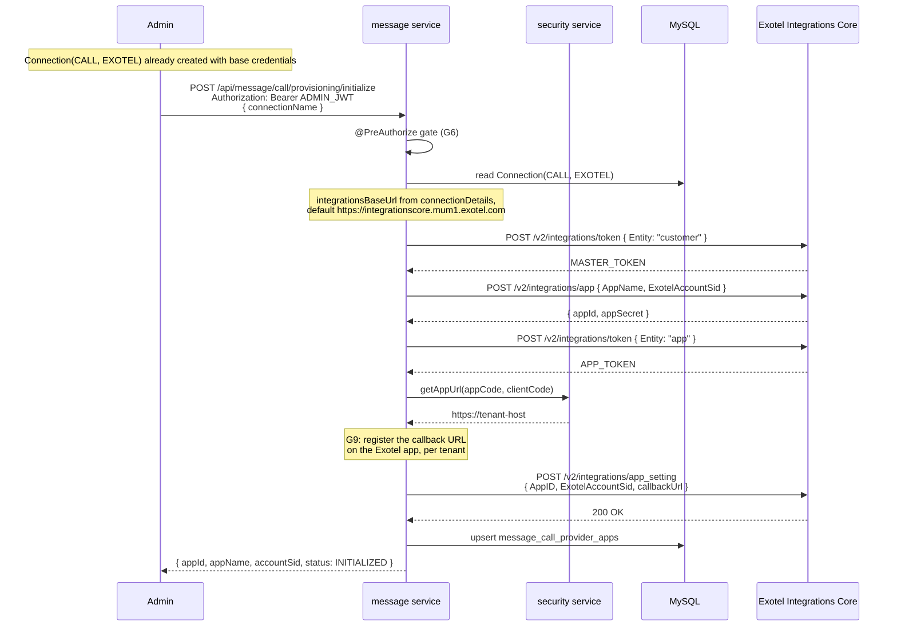
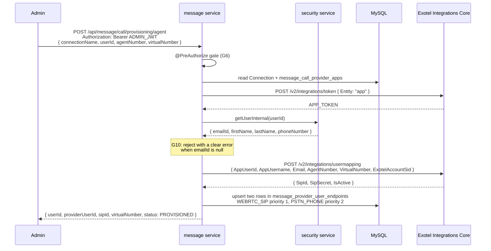
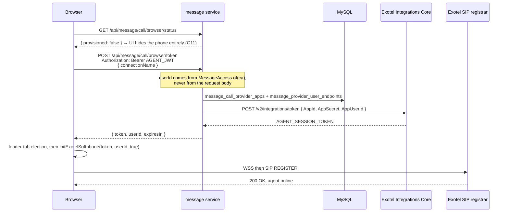
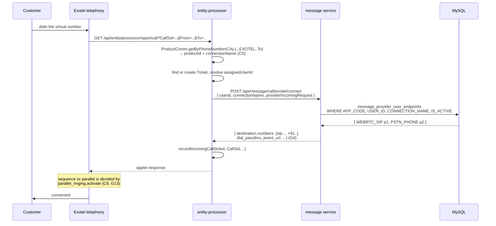
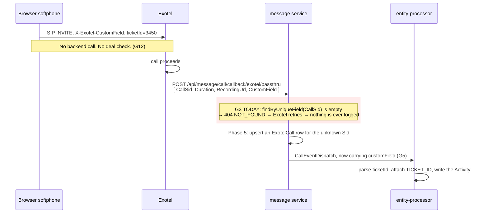

# Exotel WebRTC VOIP Integration: Backend Implementation Plan (v3, validated)

Adds browser softphone (WebRTC) calling to the `message` service, alongside the click-to-call
telephony path that already works.

**v3 changes:** every claim in v2 was checked against the code on `feature/whatsapp2`. Nine factual
errors were corrected and sixteen missing pieces of work were added. Corrections are marked
`[CORRECTED]`, new work is marked `[GAP]`, with the evidence for each. Read
[Section 0](#0-what-changed-from-v2-and-why) before estimating.

> Companion document: [EXOTEL_WEBRTC_CRM_END_TO_END_GUIDE.md](EXOTEL_WEBRTC_CRM_END_TO_END_GUIDE.md)
> covers the frontend, the app-level CSP work and the operational runbook.

---

## Table of Contents

- [0. What changed from v2, and why](#0-what-changed-from-v2-and-why)
- [1. Verified current state](#1-verified-current-state)
- [2. Design decisions](#2-design-decisions)
- [3. Open questions that block coding](#3-open-questions-that-block-coding)
- [4. End-to-end flows](#4-end-to-end-flows)
- [5. Phase 1: schema](#5-phase-1-schema)
- [6. Phase 2: jOOQ, MessageSeries, DTO and DAO](#6-phase-2-jooq-messageseries-dto-and-dao)
- [7. Phase 3: Exotel Integrations Core client](#7-phase-3-exotel-integrations-core-client)
- [8. Phase 4: dynamic SIP routing on the connect applet](#8-phase-4-dynamic-sip-routing-on-the-connect-applet)
- [9. Phase 5: callbacks for browser-originated calls](#9-phase-5-callbacks-for-browser-originated-calls)
- [10. Phase 6: ticket attribution for WebRTC calls](#10-phase-6-ticket-attribution-for-webrtc-calls)
- [11. Phase 7: provider-agnostic REST surface and authorization](#11-phase-7-provider-agnostic-rest-surface-and-authorization)
- [12. Connection details schema](#12-connection-details-schema)
- [13. Security review](#13-security-review)
- [14. File change summary](#14-file-change-summary)
- [15. Adding a future provider](#15-adding-a-future-provider)
- [16. Verification plan](#16-verification-plan)

---

## 0. What changed from v2, and why

### Corrections

| # | v2 said | Reality | Evidence |
|---|---------|---------|----------|
| C1 | Migration is `V20__Create_Call_Provider_Tables.sql` | V20 through V23 are taken. Next free is **V24** | `message/src/main/resources/db/migration/` holds `V20__Bridge_Control_Plane.sql`, `V21__Retire_Cloud_Api_Columns.sql`, `V22__Media_Ready_Event.sql`, `V23__Profile_Picture_Event.sql` |
| C2 | `createResponse()` contains a hardcoded `sip:shivameka2531b36` that must be removed | No such line exists on any pushed branch. The committed body is `List.of(destination)` | [ExotelCallService.java:403-410](../../message/src/main/java/com/fincity/saas/message/service/call/provider/exotel/ExotelCallService.java#L403-L410) |
| C3 | `ExotelApiConfig` gains `DEFAULT_TELEPHONY_BASE` | The constant is already there under a different name, `BASE_DOMAIN`. This is a rename of a public constant, not an addition | [ExotelApiConfig.java](../../message/src/main/java/com/fincity/saas/message/configuration/call/exotel/ExotelApiConfig.java) |
| C4 | Every file link pointed at `/Users/<someone>/Documents/GitHub/nocode-saas` | Links resolved on one laptop only. Now repo-relative | all links in v2 |
| C5 | Inbound: "EP posts `{userId, connectionName, providerRequest}`" without saying where `connectionName` comes from | It is resolved from **`ProductComm` keyed on the dialled virtual number**, and the Exotel-facing webhook is `GET /api/entity/processor/open/call` taking query params | [TicketCallService.java](../../entity-processor/src/main/java/com/fincity/saas/entity/processor/service/TicketCallService.java), [TicketCallController.java](../../entity-processor/src/main/java/com/fincity/saas/entity/processor/controller/open/TicketCallController.java) |
| C6 | The setup and provision curl calls carry only `appCode` / `clientCode` headers | Both are authenticated routes. Only `/api/message/call/exotel/connect` and `/api/message/call/exotel/internal/**` are permitAll. As written both examples return 401 | [MessageConfiguration.java:52-91](../../message/src/main/java/com/fincity/saas/message/configuration/MessageConfiguration.java#L52-L91) |
| C7 | "entity-processor extracts `ticketId=3450` from `CustomField` and logs an Activity" | Nothing in that chain exists. See [G5](#gaps) | `CallEventDispatch`, `CallEventRequest`, `TicketCallLogService.fromEvent()` |
| C8 | "Try SIP first, falls back to PSTN" | Whether the two ring in sequence or together is decided by `parallel_ringing.activate`, which is read straight from connection details. With it on, the browser and the desk phone ring at the same time | [ExotelCallService.java:427-438](../../message/src/main/java/com/fincity/saas/message/service/call/provider/exotel/ExotelCallService.java#L427-L438) |
| C9 | Verification runs `cd <absolute path>/message && mvn compile -pl . -am` | Repo convention is `./runmvn.sh` from the repo root, and new tables need the `jooq` profile run first | root `CLAUDE.md`, [runmvn.sh](../../runmvn.sh) |

### Gaps

Work that has to happen and was not in v2 at all.

| # | Gap | Why it matters | Phase |
|---|-----|----------------|-------|
| G1 | jOOQ regeneration and a `forcedType` for the new `JSON` columns | Without a `forcedType`, `PROVIDER_METADATA` generates as `org.jooq.JSON`, not `Map`, and the DTO will not bind | [6](#6-phase-2-jooq-messageseries-dto-and-dao) |
| G2 | `MessageSeries` entries for the two new entities | `BaseUpdatableDto` derives its `code` prefix from `MessageSeries`, and `getDtoClass()` is an exhaustive switch that will not compile without them | [6](#6-phase-2-jooq-messageseries-dto-and-dao) |
| G3 | Callbacks for calls the browser placed | `processPassThruCallback` and `processCallStatusCallback` both throw `NOT_FOUND` for an unknown `CallSid`. A WebRTC call never gets a row from `makeCall`, so every one of its callbacks 404s and Exotel retries forever | [9](#9-phase-5-callbacks-for-browser-originated-calls) |
| G4 | `dial_passthru_event_url` is never populated | The field exists on `ExotelConnectAppletResponse` but `applyConnectionDetailsToResponse` skips it, so inbound calls never request a passthru event and never report duration or recording | [8](#8-phase-4-dynamic-sip-routing-on-the-connect-applet) |
| G5 | `CustomField` to ticket attribution | `message` parses `CustomField` on all three Exotel callbacks but never forwards it. `CallEventDispatch` has no such field, `CallEventRequest` has no such field, and `TicketCallLogService.fromEvent()` never reads one. Every WebRTC call lands as a call row with a null `TICKET_ID` | [10](#10-phase-6-ticket-attribution-for-webrtc-calls) |
| G6 | Authorization on the new endpoints | The `message` service has **zero** `@PreAuthorize` annotations. The two admin endpoints hold Exotel account credentials and can mint SIP credentials for any user id | [11](#11-phase-7-provider-agnostic-rest-surface-and-authorization) |
| G7 | Which `clientCode` keys an endpoint row | The plan read `connection.getClientCode()`. `Connection` is an `AbstractOverridableDTO`, so that is the client owning the *definition*, often SYSTEM through an override, not the runtime tenant | [5](#5-phase-1-schema) |
| G8 | `VirtualNumber` has no source | `ProductComm` holds virtual numbers per product and connection, and there can be several per connection. `message` cannot read `ProductComm` | [7](#7-phase-3-exotel-integrations-core-client) |
| G9 | Callback URL registration for WebRTC calls | `makeCall` sets `statusCallback` per call. A browser SIP call has no per-call hook, so the URL has to be registered on the Exotel app at setup time, per tenant | [7](#7-phase-3-exotel-integrations-core-client) |
| G10 | `emailId` is nullable | `AppUserId` is the user's email. `User.emailId` is null for phone-only users | [7](#7-phase-3-exotel-integrations-core-client) |
| G11 | No way for the UI to ask "am I provisioned" | `/browser/token` would just error for an unprovisioned agent, with nothing to distinguish that from an outage | [11](#11-phase-7-provider-agnostic-rest-surface-and-authorization) |
| G12 | Deal-gating is lost for WebRTC outbound | `TicketCallLogService.makeCall` deliberately takes the number from the deal. `window.exotelDial(number)` bypasses that completely | [13](#13-security-review) |
| G13 | Sequential vs parallel ringing is undecided | See C8 | [8](#8-phase-4-dynamic-sip-routing-on-the-connect-applet) |
| G14 | `ConnectionSubType` and `ConnectionType` each exist in three copies | The "adding a provider" section counted one file per enum | [15](#15-adding-a-future-provider) |
| G15 | Migration style does not match the repo | Existing migrations are schema-qualified and backticked, carry a `COMMENT` on every column and use `UK1_` / `IDX1_` index naming | [5](#5-phase-1-schema) |
| G16 | The Exotel Integrations Core API surface is unverified | Nothing in this plan cites a vendor document. See [Section 3](#3-open-questions-that-block-coding) | [3](#3-open-questions-that-block-coding) |

### Security

[Section 13](#13-security-review) is a full review: twelve findings, three rated HIGH. Two of them
(S2, S11) correct advice given elsewhere in this document, so read it before implementing Phases 1
and 2. Three findings are pre-existing holes this work would widen rather than create.

---

## 1. Verified current state

Everything below was read on `feature/whatsapp2`.

### Exists and works

| Component | Location | Notes |
|-----------|----------|-------|
| `CALL(EXOTEL)` connection type | [ConnectionType.java](../../commons-core/src/main/java/com/fincity/saas/commons/core/enums/ConnectionType.java) | Also mirrored in `message/oserver` and `entity-processor/oserver` |
| Provider dispatcher | [CallService.java](../../message/src/main/java/com/fincity/saas/message/service/call/CallService.java) | `EnumMap<ConnectionSubType, ICallService<?>>`, registered in `@PostConstruct init()` |
| Provider base | [AbstractCallProviderService.java](../../message/src/main/java/com/fincity/saas/message/service/call/provider/AbstractCallProviderService.java) | Supplies `getUserIdAndPhone`, `getCallBackAppUrl`, `getConnectionDetail`, `isValidConnection` |
| Exotel provider | [ExotelCallService.java](../../message/src/main/java/com/fincity/saas/message/service/call/provider/exotel/ExotelCallService.java) | `makeCall`, `makeCallInternal`, `connectCall`, `processCallStatusCallback`, `processPassThruCallback` |
| Telephony WebClient | [WebClientConfig.java](../../message/src/main/java/com/fincity/saas/message/configuration/WebClientConfig.java) | `createExotelWebClient` builds `BASE_DOMAIN + "/" + accountSid` with Basic auth |
| Inbound webhook | [TicketCallController.java](../../entity-processor/src/main/java/com/fincity/saas/entity/processor/controller/open/TicketCallController.java) | `GET /api/entity/processor/open/call` |
| Inbound routing | [TicketCallService.java](../../entity-processor/src/main/java/com/fincity/saas/entity/processor/service/TicketCallService.java) | Resolves `ProductComm` by dialled number, finds or creates the ticket, calls `connectCall` |
| Deal-gated call log | [TicketCallLogService.java](../../entity-processor/src/main/java/com/fincity/saas/entity/processor/service/message/TicketCallLogService.java) | `readTicketCalls`, `makeCall`, `recordIncomingCall`, `accept` |
| Event handoff | `EventDispatcher` plus `message_dispatch_outbox` | `message` enqueues, `entity-processor` accepts at `POST /api/entity/processor/calls/internal/event` |

### The two facts that shape this whole plan

**Outbound today goes through a deal check.** `TicketCallLogService.makeCall` reads the ticket, takes
the number *from the ticket* and calls `POST /api/message/call/exotel/internal/make`. The comment on
that method is explicit that taking the number server-side is the point. WebRTC dialling does not and
cannot work that way: the SIP credential lives in the browser. See [G12](#gaps).

**Inbound already resolves a ticket before it connects.** By the time `connectCall` runs,
`TicketCallService` has a `Ticket` and an `assignedUserId`. That is why inbound attribution is exact
and outbound WebRTC attribution is the hard problem.

### Confirmed absent

- No `@PreAuthorize` anywhere in `message` (`grep -rl PreAuthorize message/src/main/java | wc -l` returns 0).
- No `customField` on `CallEventDispatch` or `CallEventRequest`.
- No secret-encryption utility in the codebase. Connection credentials sit in plaintext in Mongo today.
- No telephony code of any kind in `nocode-ui/ui-app/client/src` (`grep -ri "exotel\|webrtc\|softphone\|sip"` returns nothing).

---

## 2. Design decisions

| Decision | Choice | Rationale |
|----------|--------|-----------|
| Credentials source | `Connection.connectionDetails` | Matches `MAIL(SENDGRID, SMTP)`. Multi-tenant falls out of it |
| Exotel app creation | Automated on `POST /provisioning/initialize` | Admin supplies base credentials only |
| Agent mapping | Manual, one REST call per agent | Auto-provisioning every user would mint SIP credentials nobody asked for |
| Token strategy | Fresh token per page load, plus in-tab refresh | 24h expiry against a CRM tab that stays open for days. See [G23 in the guide](EXOTEL_WEBRTC_CRM_END_TO_END_GUIDE.md) |
| App secret at rest | Plaintext in MySQL | Consistent with connection credentials in Mongo. Called out in [Section 13](#13-security-review) rather than silently accepted |
| Provider abstraction | Browser calling is a **capability interface** (`IBrowserCallService`), not extra `default` methods on `ICallService`. Routes are provider-neutral (`/provisioning/*`, `/browser/*`) and the UI learns the provider from the response | A provider that only does click-to-call must be able to say so. See [11.1](#111-the-capability-interface-decision) and [11.5](#115-why-provider-comes-from-the-response-decision) |
| Endpoint row key | `(APP_CODE, CLIENT_CODE, USER_ID, CONNECTION_NAME, ENDPOINT_TYPE)`, with the tenant resolved from **the agent's own client** on both write and read | Resolves [G7](#gaps) without opening the cross-tenant read that dropping `CLIENT_CODE` would cause. See [S11](#s11-the-tenant-key-recommendation-in-section-5-trades-a-bug-for-a-cross-tenant-read-medium) |

---

## 3. Open questions that block coding

Answer these before Phase 3. They are not stylistic.

1. **Exotel Integrations Core API contract.** [G16](#gaps). This plan asserts
   `POST /v2/integrations/{token,app,app_setting,usermapping}` with particular request and response
   shapes, sourced from a working manual run rather than a vendor document. Before coding, get the
   Exotel Integrations Core reference or Postman collection and confirm: the exact `Entity` values on
   `/token`; whether `/app` returns `AppSecret` or it must be fetched separately; whether
   `/usermapping` takes an array or a single object; the real token TTL; the rate limits; and whether
   the status and passthru callback URL is settable through `/app_setting` (this decides
   [G9](#gaps)).
2. **Sequential or parallel ringing.** [C8](#corrections), [G13](#gaps). Should the desk phone ring
   at the same time as the browser, or only after the browser fails to answer? This changes the
   `parallel_ringing` contract and it is a product decision.
3. **WebRTC outbound authorization.** [G12](#gaps). Either accept that a provisioned agent can dial
   anything and add detection after the fact, or restrict WebRTC to inbound and answer-only. Pick one
   explicitly.
4. **Which `Authorities` value gates setup and provisioning.** [G6](#gaps). `ROLE_Owner` is the
   nearest precedent (`WhatsappSendOptionsService`), but a dedicated authority may be wanted.
5. **Region.** `integrationscore.mum1.exotel.com` and `voip.in1.exotel.com` are Mumbai and India.
   Confirm there is no non-India tenant in scope, because the guide's CSP work has to name these hosts.

---

## 4. End-to-end flows

### 4.1 Setup, once per tenant, uses `integrationsBaseUrl`



### 4.2 Agent provisioning, once per agent, uses `integrationsBaseUrl`



`virtualNumber` is now an explicit request field. It has no other source: `ProductComm` lives in
`entity-processor` and holds one virtual number per product and connection, so `message` can neither
read it nor guess which of several applies. See [G8](#gaps).

### 4.3 Browser token, every page load, uses `integrationsBaseUrl`



### 4.4 Inbound, dynamic SIP routing



### 4.5 Outbound WebRTC, and where attribution breaks today



The red block is the single most important finding in this review. Nothing about outbound WebRTC
logging works today, and neither document acknowledged it.

---

## 5. Phase 1: schema

### `V24__Create_Call_Provider_Tables.sql` [CORRECTED C1]

`message/src/main/resources/db/migration/V24__Create_Call_Provider_Tables.sql`

Style follows `V20__Bridge_Control_Plane.sql`: schema-qualified backticked names, a `COMMENT` on every
column, `UK1_` and `IDX1_` index naming [G15].

```sql
-- Exotel integration apps, one per tenant connection, created by POST /provisioning/initialize.
--
-- Tenant-scoped, unlike message_bridge_instances: an Exotel app belongs to exactly one customer's
-- Exotel account and must never be visible across tenants.
CREATE TABLE `message`.`message_call_provider_apps`
(
    `ID`                  BIGINT UNSIGNED NOT NULL AUTO_INCREMENT COMMENT 'Primary key.',
    `CODE`                CHAR(22)        NOT NULL COMMENT 'Short unique code, from BaseUpdatableDto. Required by the base DAO.',

    `APP_CODE`            CHAR(6)         NOT NULL COMMENT 'Modlix app this registration belongs to.',
    `CLIENT_CODE`         CHAR(8)         NOT NULL COMMENT 'Tenant. From MessageAccess, never from the Connection document: a Connection is overridable, so its own clientCode may be SYSTEM. See G7.',

    `CONNECTION_NAME`     VARCHAR(256)    NOT NULL COMMENT 'Name of the CALL/EXOTEL Connection whose credentials created this app.',
    `PROVIDER`            VARCHAR(32)     NOT NULL DEFAULT 'EXOTEL' COMMENT 'Matches ConnectionSubType.getProvider(). A column rather than an enum so a second provider does not need a migration.',

    `PROVIDER_APP_ID`     VARCHAR(256)    NOT NULL COMMENT 'Exotel AppID.',
    `PROVIDER_APP_SECRET` VARCHAR(512)    NOT NULL COMMENT 'Exotel AppSecret. Plaintext, consistent with connection credentials in Mongo. See Section 13.',
    `PROVIDER_APP_NAME`   VARCHAR(256)             DEFAULT NULL COMMENT 'AppName sent to Exotel, for operator recognition in their dashboard.',
    `ACCOUNT_SID`         VARCHAR(256)    NOT NULL COMMENT 'Exotel AccountSid this app is bound to.',
    `CALLBACK_URL`        VARCHAR(512)             DEFAULT NULL COMMENT 'Status and passthru URL registered on the Exotel app at setup. Stored so a host change is detectable without an Exotel round trip. See G9.',

    `PROVIDER_METADATA`   JSON                     DEFAULT NULL COMMENT 'Raw provider response, kept for diagnosis. Needs a forcedType entry in pom.xml or it generates as org.jooq.JSON. See G1.',

    `IS_ACTIVE`           TINYINT         NOT NULL DEFAULT 1 COMMENT 'Cleared to retire a registration without losing the audit trail.',
    `CREATED_BY`          BIGINT UNSIGNED          DEFAULT NULL COMMENT 'ID of the user who created this row.',
    `CREATED_AT`          TIMESTAMP       NOT NULL DEFAULT CURRENT_TIMESTAMP COMMENT 'Time when this row is created.',
    `UPDATED_BY`          BIGINT UNSIGNED          DEFAULT NULL COMMENT 'ID of the user who updated this row.',
    `UPDATED_AT`          TIMESTAMP       NOT NULL DEFAULT CURRENT_TIMESTAMP ON UPDATE CURRENT_TIMESTAMP COMMENT 'Time when this row is updated.',

    PRIMARY KEY (`ID`),
    UNIQUE KEY `UK1_CALL_PROVIDER_APPS_CODE` (`CODE`),
    UNIQUE KEY `UK2_CALL_PROVIDER_APPS_CONNECTION` (`APP_CODE`, `CLIENT_CODE`, `CONNECTION_NAME`, `PROVIDER`)

) ENGINE = InnoDB
  DEFAULT CHARSET = `utf8mb4`
  COLLATE = `utf8mb4_unicode_ci` COMMENT = 'Provider-side integration app registrations for browser calling, one per tenant connection.';


-- Per-agent call destinations, used to build the connect-applet response.
--
-- CLIENT_CODE is in the unique key and in every lookup. The mismatch G7 describes is real (rows
-- written under the provisioning admin's clientCode, read under the clientCode on the inbound
-- webhook) but dropping the column from the key is the wrong fix: an unfiltered lookup returns
-- another tenant's agent SIP identities, and the route that reads it is permitAll. See S11.
--
-- Fixed at the source instead: both sides derive the tenant from the AGENT's own client, via
-- getUserInternal(userId).getClientId(), so they agree by construction and the filter stays on.
CREATE TABLE `message`.`message_provider_user_endpoints`
(
    `ID`                BIGINT UNSIGNED NOT NULL AUTO_INCREMENT COMMENT 'Primary key.',
    `CODE`              CHAR(22)        NOT NULL COMMENT 'Short unique code, from BaseUpdatableDto.',

    `APP_CODE`          CHAR(6)         NOT NULL COMMENT 'Modlix app this endpoint belongs to.',
    `CLIENT_CODE`       CHAR(8)         NOT NULL COMMENT 'The AGENT''s own client, from getUserInternal(userId).getClientId(). Not the caller''s. Part of the unique key and of every lookup. See S11.',
    `USER_ID`           BIGINT UNSIGNED NOT NULL COMMENT 'Security user id of the agent.',

    `CONNECTION_NAME`   VARCHAR(256)    NOT NULL COMMENT 'Connection this endpoint was provisioned against.',
    `PROVIDER`          VARCHAR(32)     NOT NULL DEFAULT 'EXOTEL' COMMENT 'Matches ConnectionSubType.getProvider().',

    `ENDPOINT_TYPE`     VARCHAR(32)     NOT NULL COMMENT 'WEBRTC_SIP or PSTN_PHONE. A string rather than an ENUM so a third destination kind does not need a migration.',
    `ENDPOINT_VALUE`    VARCHAR(512)    NOT NULL COMMENT 'What goes into destination.numbers: a sip: URI, or an E.164 number.',
    `PRIORITY`          INT             NOT NULL DEFAULT 1 COMMENT 'Lower rings first. SIP 1, PSTN 2. Only meaningful when parallel_ringing is off. See G13.',

    `VIRTUAL_NUMBER`    VARCHAR(32)              DEFAULT NULL COMMENT 'Virtual number this mapping was created against, supplied by the caller. See G8.',
    `PROVIDER_USER_ID`  VARCHAR(256)             DEFAULT NULL COMMENT 'Exotel AppUserId, the agent email. What the browser passes to initExotelSoftphone.',
    `PROVIDER_METADATA` JSON                     DEFAULT NULL COMMENT 'SipSecret and the rest of the provider response. Needs a forcedType entry. See G1.',

    `IS_ACTIVE`         TINYINT         NOT NULL DEFAULT 1 COMMENT 'Cleared by DELETE /provisioning/agent/{userId}. A soft delete, so a deprovisioned agent stays auditable.',
    `CREATED_BY`        BIGINT UNSIGNED          DEFAULT NULL COMMENT 'ID of the user who created this row.',
    `CREATED_AT`        TIMESTAMP       NOT NULL DEFAULT CURRENT_TIMESTAMP COMMENT 'Time when this row is created.',
    `UPDATED_BY`        BIGINT UNSIGNED          DEFAULT NULL COMMENT 'ID of the user who updated this row.',
    `UPDATED_AT`        TIMESTAMP       NOT NULL DEFAULT CURRENT_TIMESTAMP ON UPDATE CURRENT_TIMESTAMP COMMENT 'Time when this row is updated.',

    PRIMARY KEY (`ID`),
    UNIQUE KEY `UK1_PROVIDER_USER_ENDPOINTS_CODE` (`CODE`),
    UNIQUE KEY `UK2_PROVIDER_USER_ENDPOINTS_AGENT` (`APP_CODE`, `CLIENT_CODE`, `USER_ID`, `CONNECTION_NAME`, `ENDPOINT_TYPE`),
    KEY `IDX1_PROVIDER_USER_ENDPOINTS_ROUTING` (`APP_CODE`, `CLIENT_CODE`, `USER_ID`, `IS_ACTIVE`, `PRIORITY`)

) ENGINE = InnoDB
  DEFAULT CHARSET = `utf8mb4`
  COLLATE = `utf8mb4_unicode_ci` COMMENT = 'Where a given agent can be reached, in ringing order. Read on every inbound connect applet.';
```

Note `IDX1_PROVIDER_USER_ENDPOINTS_ROUTING` is ordered to serve the hot query exactly: the connect
applet reads by app, user and active flag, ordered by priority, on every inbound call.

---

## 6. Phase 2: jOOQ, MessageSeries, DTO and DAO

### 6.1 `forcedType` entries in `message/pom.xml` [GAP G1]

Both new tables have a `PROVIDER_METADATA JSON` column. The `jooq` profile has no catch-all for
`JSON`, only per-column patterns. Without an entry these generate as `org.jooq.JSON` and the DTO
field will not bind. Add inside `<forcedTypes>`, following the existing scoped-pattern convention:

```xml
<forcedType>
    <userType>java.util.Map</userType>
    <converter>com.fincity.saas.commons.jooq.convertor.jooq.converters.JSONtoClassConverter</converter>
    <includeTypes>JSON</includeTypes>
    <genericConverter>true</genericConverter>
    <includeExpression>.*\.PROVIDER_METADATA</includeExpression>
</forcedType>
```

Then regenerate. Codegen reads the live local schema, so the migration must be applied first, by hand
on local (Flyway does not run there).

```bash
cd /path/to/nocode-saas
./runmvn.sh jooq
```

This writes `MessageCallProviderAppsRecord` and `MessageProviderUserEndpointsRecord` into
`message/src/main/java/com/fincity/saas/message/jooq/`. Commit the generated files; that is the
existing convention.

### 6.2 `MessageSeries` entries [GAP G2]

[MessageSeries.java](../../message/src/main/java/com/fincity/saas/message/enums/MessageSeries.java)
gives every `BaseUpdatableDto` its `code` prefix, and `getDtoClass()` is an exhaustive switch that
will not compile without the new arms.

```java
CALL_PROVIDER_APP("CALL_PROVIDER_APP", "Call Provider App", 8, "call_provider_app",
        MESSAGE_CALL_PROVIDER_APPS),
PROVIDER_USER_ENDPOINT("PROVIDER_USER_ENDPOINT", "Provider User Endpoint", 9,
        "provider_user_endpoint", MESSAGE_PROVIDER_USER_ENDPOINTS),
```

Use 8 and 9. The file documents that 5, 6 and 7 belonged to retired WhatsApp entities and must not be
reused, because live rows still carry codes built from them.

### 6.3 DTOs

`message/src/main/java/com/fincity/saas/message/dto/call/CallProviderApp.java`

Extends `BaseUpdatableDto<CallProviderApp>`, which already supplies `id`, `appCode`, `clientCode`,
`userId`, `code`, `isActive` and the audit columns. Declare only: `connectionName`, `provider`,
`providerAppId`, `providerAppSecret`, `providerAppName`, `accountSid`, `callbackUrl`,
`providerMetadata`.

`message/src/main/java/com/fincity/saas/message/dto/call/ProviderUserEndpoint.java`

Same base. Declare: `connectionName`, `provider`, `endpointType`, `endpointValue`, `priority`,
`virtualNumber`, `providerUserId`, `providerMetadata`.

`BaseUpdatableDto` already has a `userId` field, so `ProviderUserEndpoint` must **not** redeclare one.
The agent is that `userId`.

**Do not give either DTO a `BaseUpdatableController`.** `@JsonIgnore` on `providerAppSecret` is not
sufficient protection and would give false confidence: the eager read paths return
`Map<String, Object>` built by `rec.intoMap()`
([IEagerDAO.java:66](../../message/src/main/java/com/fincity/saas/message/eager/IEagerDAO.java#L66)),
so Jackson annotations on the DTO are bypassed entirely. See [S2](#s2-the-generic-query-surface-would-leak-both-secrets-and-jsonignore-does-not-stop-it-high).

Add `@JsonIgnore` anyway, as defence in depth for the paths where it does apply, but the control that
matters is not mounting the generic surface.

### 6.4 DAOs

Extend `BaseUpdatableDAO`, not `BaseProviderDAO`. `BaseProviderDAO` exists for provider-side
message and call records keyed on a provider id, which these are not.

`CallProviderAppDAO`
- `findByConnection(appCode, clientCode, connectionName, provider)` returns `Mono<CallProviderApp>`
- `upsert(CallProviderApp)`, resolving on `UK2_CALL_PROVIDER_APPS_CONNECTION`

`ProviderUserEndpointDAO`
- `findActiveEndpoints(appCode, clientCode, userId, connectionName, provider)` returns
  `Flux<ProviderUserEndpoint>` ordered by `PRIORITY`. `clientCode` is the agent's own, per [S11](#s11-the-tenant-key-recommendation-in-section-5-trades-a-bug-for-a-cross-tenant-read-medium)
- `findByConnection(appCode, clientCode, connectionName)` for the admin list
- `upsertEndpoint(ProviderUserEndpoint)`, resolving on `UK2_PROVIDER_USER_ENDPOINTS_AGENT`
- `deactivate(appCode, clientCode, userId, connectionName)` sets `IS_ACTIVE = 0`

---

## 7. Phase 3: Exotel Integrations Core client

### 7.1 `ExotelApiConfig` [CORRECTED C3]

The existing constant is `BASE_DOMAIN`. Renaming it to `DEFAULT_TELEPHONY_BASE` is clearer but is a
public-constant rename; do it as its own commit, or leave it alone. Nothing else in this plan depends
on the name.

### 7.2 `ExotelIntegrationsApiConfig.java` [NEW]

`message/src/main/java/com/fincity/saas/message/configuration/call/exotel/ExotelIntegrationsApiConfig.java`

```java
public final class ExotelIntegrationsApiConfig {

    public static final String DEFAULT_INTEGRATIONS_BASE = "https://integrationscore.mum1.exotel.com";

    private ExotelIntegrationsApiConfig() {}

    public static String tokenUrl()       { return "/v2/integrations/token"; }
    public static String appUrl()         { return "/v2/integrations/app"; }
    public static String appSettingUrl()  { return "/v2/integrations/app_setting"; }
    public static String userMappingUrl() { return "/v2/integrations/usermapping"; }
}
```

Paths pending confirmation against the vendor reference. See [Section 3, item 1](#3-open-questions-that-block-coding).

### 7.3 `WebClientConfig` [MODIFY]

```java
public WebClient createExotelIntegrationsWebClient(Connection connection, String bearerToken) {
    String baseUrl = (String) connection.getConnectionDetails()
            .getOrDefault("integrationsBaseUrl", ExotelIntegrationsApiConfig.DEFAULT_INTEGRATIONS_BASE);

    return WebClient.builder()
            .baseUrl(baseUrl)
            .filter(new ReactiveAuthenticationInterceptor(bearerToken, ReactiveAuthenticationScheme.BEARER))
            .build();
}
```

Confirm `ReactiveAuthenticationScheme.BEARER` exists before relying on it. The only schemes in use
today are `BASIC` and `NONE`; if `BEARER` is absent, add it there rather than hand-building the
header at each call site.

Making the telephony base URL configurable is a separate, optional change. `createExotelWebClient`
uses the `BASE_DOMAIN` constant today and no tenant has needed otherwise.

### 7.4 `ExotelIntegrationsService.java` [NEW, the core of this work]

`message/src/main/java/com/fincity/saas/message/service/call/provider/exotel/ExotelIntegrationsService.java`

| Method | Reads | Writes | Notes |
|--------|-------|--------|-------|
| `initializeApp(access, connection)` | Connection | `message_call_provider_apps` | Also registers the callback URL, see below |
| `provisionAgent(access, connection, request)` | Connection, app row, security user | two `message_provider_user_endpoints` rows | `virtualNumber` is required, see G8 |
| `generateBrowserToken(access, connection, userId)` | app row, endpoint row | nothing | Fresh token per call |
| `getAgentEndpoints(access, connection)` | endpoint rows | nothing | Admin list |
| `browserCallStatus(access, connection, userId)` | endpoint row | nothing | Drives the UI's dormant-or-active decision, [G11](#gaps) |
| `deactivateAgent(access, connection, userId)` | endpoint rows | `IS_ACTIVE = 0` | Soft delete. Revokes nothing already issued, see [S8](#s8-tokens-cannot-be-revoked-and-minting-is-unbounded-medium) |

Chain everything with `FlatMapUtil.flatMapMono` and close each public method with
`.contextWrite(Context.of(LogUtil.METHOD_NAME, "ExotelIntegrationsService.<method>"))`, matching
`ExotelCallService`.

**`initializeApp` sequence**

1. Read the `Connection`, run it through `isValidConnection` so a `MAIL` connection cannot get this far.
2. Require `customerId`, `customerSecret` and `accountSid`. Missing any one is a `BAD_REQUEST` naming
   the field, through `MessageResourceService.MISSING_CONNECTION_DETAILS`.
3. `POST /token { Entity: "customer" }` gives `MASTER_TOKEN`.
4. `POST /app { AppName: appCode + "-" + clientCode + "-call", ExotelAccountSid }`.
   Include `clientCode` in the name: `appCode` alone collides across tenants sharing one Exotel account.
5. `POST /token { Entity: "app" }` gives `APP_TOKEN`, if `/app` did not already return the secret.
6. **[G9]** `securityService.getAppUrl(appCode, clientCode)`, append
   `AbstractCallProviderService.CALL_BACK_URI + "/exotel"`, and register it through `/app_setting`.
   This is what makes callbacks for browser-originated calls arrive at all. `getAppUrl` returns the
   tenant's own host, and the gateway derives `appCode` and `clientCode` from that host
   ([GatewayFilter.java:127-150](../../gateway/src/main/java/com/fincity/gateway/GatewayFilter.java#L127-L150)),
   which is why no header has to be attached.
7. Upsert `message_call_provider_apps`, storing `callbackUrl` alongside the credentials.

Idempotent. Re-running against a connection that already has a row must not create a second Exotel
app. Read first, and if a row exists, refresh the callback URL and return the existing `appId`.

**`provisionAgent` sequence**

1. Read the `Connection` and the app row. No app row is a `BAD_REQUEST` telling the admin to run
   `/provisioning/initialize` first, not a 404.
2. `POST /token { Entity: "app" }`.
3. `securityService.getUserInternal(userId, null)`. Available fields are `emailId`, `firstName`,
   `lastName`, `middleName`, `userName`, `phoneNumber`
   ([User.java](../../commons-security/src/main/java/com/fincity/saas/commons/security/model/User.java)).
4. **[G10]** `emailId` is nullable. Reject with a message naming the user, rather than sending a null
   `AppUserId` to Exotel. Do not silently fall back to `userName`: `AppUserId` is the identity the
   browser passes to `initExotelSoftphone`, and a non-email there is very hard to debug later.
5. `POST /usermapping` with `AppUserId`, `AppUsername`, `Email`, `AgentNumber`, `VirtualNumber`,
   `ExotelAccountSid`.
6. Upsert two endpoint rows: `WEBRTC_SIP` at priority 1 with value `"sip:" + sipId`, and `PSTN_PHONE`
   at priority 2 with `agentNumber`. Store `sipSecret` in `PROVIDER_METADATA` and never return it.
7. Also idempotent: re-provisioning the same agent updates in place.

**`generateBrowserToken` sequence**

1. Read the app row, then the agent's `WEBRTC_SIP` endpoint row for `providerUserId`.
2. No active endpoint row is a `FORBIDDEN`, not a 404, and the message should say the user is not
   provisioned for browser calling. The UI branches on this.
3. `POST /token { AppId, AppSecret, AppUserId }`.
4. Return `{ token, userId: providerUserId, expiresIn }`. Never return `appSecret`.

Do not cache these tokens. The decision is a fresh token per page load, and a cached one shared
between two agents would be a cross-agent credential leak.

---

## 8. Phase 4: dynamic SIP routing on the connect applet

### 8.1 `createResponse` [CORRECTED C2]

There is no hardcoded SIP URI to remove. The committed body at
[ExotelCallService.java:403-410](../../message/src/main/java/com/fincity/saas/message/service/call/provider/exotel/ExotelCallService.java#L403-L410)
is:

```java
private Mono<ExotelConnectAppletResponse> createResponse(String destination, Connection connection) {
    ExotelConnectAppletResponse response = new ExotelConnectAppletResponse();
    this.applyConnectionDetailsToResponse(response, connection.getConnectionDetails());
    response.setDestination(new ExotelConnectAppletResponse.Destination().setNumbers(List.of(destination)));
    return Mono.just(response);
}
```

If anyone is carrying a local `List.of("sip:...", destination)`, that is an uncommitted experiment.
Do not treat it as the baseline.

The change is additive: prepend the agent's active SIP endpoints ahead of the PSTN number.

```java
private Mono<ExotelConnectAppletResponse> createResponse(
        MessageAccess access, ULong userId, String connectionName, String pstnFallback, Connection connection) {

    return this.providerUserEndpointDAO
            .findActiveEndpoints(
                    access.getAppCode(), agentClientCode, userId, connectionName,
                    this.getConnectionSubType().getProvider())
            .collectList()
            .map(endpoints -> {
                ExotelConnectAppletResponse response = new ExotelConnectAppletResponse();
                this.applyConnectionDetailsToResponse(response, connection.getConnectionDetails());

                List<String> destinations = endpoints.stream()
                        .filter(e -> WEBRTC_SIP.equals(e.getEndpointType()))
                        .sorted(Comparator.comparingInt(ProviderUserEndpoint::getPriority))
                        .map(ProviderUserEndpoint::getEndpointValue)
                        .collect(Collectors.toCollection(ArrayList::new));

                // Always last, and always present. An agent with no SIP endpoint, or one whose
                // browser is shut, still has to be reachable: this is a live customer on the line.
                if (pstnFallback != null && !destinations.contains(pstnFallback))
                    destinations.add(pstnFallback);

                if (destinations.isEmpty()) {
                    logger.warn(
                            "No destination for user {} on connection {}. The applet response will be empty.",
                            userId, connectionName);
                }

                response.setDestination(
                        new ExotelConnectAppletResponse.Destination().setNumbers(destinations));

                logger.info("Routing inbound call for user {} to {}", userId, destinations);
                return response;
            });
}
```

Two things v2 got wrong here:

- It read `connection.getAppCode()` and `connection.getClientCode()`. `Connection` extends
  `AbstractOverridableDTO`, so those name the client owning the *definition*, which for an
  overridden connection is the parent, often SYSTEM. Use `access.getAppCode()` for the app, and
  `agentClientCode`, resolved from the agent's own user record, for the tenant. [G7],
  [S11](#s11-the-tenant-key-recommendation-in-section-5-trades-a-bug-for-a-cross-tenant-read-medium)
- It filtered on `e.getIsActive()` in Java. The DAO already filters on `IS_ACTIVE` and the index is
  built for it. Filtering again in memory means reading inactive rows on every inbound call.

`connectCall` then passes the extra arguments. The `access` and `connection` values are already local
at that point ([ExotelCallService.java:381-399](../../message/src/main/java/com/fincity/saas/message/service/call/provider/exotel/ExotelCallService.java#L381-L399)):

```java
Mono<ExotelConnectAppletResponse> responseCreated = createResponse(
        access, user.getId(), request.getConnectionName(),
        user.getValue().getNumber(), connection);
```

### 8.2 Populate `dial_passthru_event_url` [GAP G4]

`ExotelConnectAppletResponse` has a `dial_passthru_event_url` field
([ExotelConnectAppletResponse.java](../../message/src/main/java/com/fincity/saas/message/model/response/call/provider/exotel/ExotelConnectAppletResponse.java))
that `applyConnectionDetailsToResponse` never sets. That is the per-call hook for a passthru event
carrying duration and recording URL, so inbound calls currently report neither.

Add it to `applyConnectionDetailsToResponse`, defaulting to
`getCallBackAppUrl(appCode) + "/passthru"` rather than requiring a connection detail. The controller
already accepts both `GET` and `POST` on that path
([ExotelCallBackController.java](../../message/src/main/java/com/fincity/saas/message/controller/call/provider/exotel/ExotelCallBackController.java)),
so no new route is needed.

Small change, real gain, and it is a prerequisite for the inbound half of Phase 6.

### 8.3 Decide the ringing mode [GAP G13, CORRECTED C8]

`applyConnectionDetailsToResponse` reads `parallel_ringing.activate` straight from connection
details. Consequences, which are opposite and both defensible:

- `activate: false`, sequential. The browser rings first, and only after
  `max_ringing_duration` does the desk phone ring. Total time to answer roughly doubles for an
  offline agent.
- `activate: true`, parallel. Browser and desk phone ring together. Fast, but a logged-in agent gets
  a double ring on every call, which most CRM users dislike.

Whichever is chosen, document it in the connection details schema and stop leaving it to whoever
authors the Connection. If the answer is sequential, `PRIORITY` is load-bearing; if parallel, it is
decoration, and the plan should say so.

---

## 9. Phase 5: callbacks for browser-originated calls

**[GAP G3]. This phase did not exist in v2 and without it outbound WebRTC produces no record at all.**

Both callback handlers are lookup-then-throw:

```java
// processPassThruCallback, and processCallStatusCallback identically
this.findByUniqueField(access, callback.getCallSid())
        .switchIfEmpty(super.msgService.throwMessage(
                msg -> new GenericException(HttpStatus.NOT_FOUND, msg),
                MessageResourceService.CALL_NOT_FOUND,
                callback.getCallSid()))
```

That is correct for the paths that exist today. Every call in `message_exotel_calls` got there
through `makeExotelCall` (outbound API) or `connectCall` (inbound applet), so an unknown `CallSid` is
genuinely an error.

A WebRTC call goes through neither. The browser sends a SIP INVITE straight to Exotel. Nothing on the
backend hears about it until the callback arrives, and by then:

1. `findByUniqueField` is empty.
2. A 404 goes back to Exotel.
3. Exotel retries on its own schedule and gets the same 404.
4. The call is never logged, so no duration, no recording URL, nothing in the ticket timeline.

### The change

Add an upsert path. When the `CallSid` is unknown **and** the callback looks like a WebRTC-originated
call, create the row instead of throwing.

```java
private Mono<ExotelCall> resolveOrCreate(MessageAccess access, String callSid, ExotelDirection direction) {

    return this.findByUniqueField(access, callSid)
            .switchIfEmpty(Mono.defer(() -> {
                // A call this service never placed. Today that means a browser softphone: the SIP
                // credential is in the page, so the INVITE never passes through here. Creating the
                // row is the only way the call gets logged at all, and dropping it would lose
                // exactly the calls the agents make most.
                logger.info("First sight of call {}. Creating a record for a provider-originated call.", callSid);
                return this.createInternal(access, ExotelCall.ofProviderOriginated(callSid, direction)
                        .setOwnerService(this.defaultCallOwnerService));
            }));
}
```

Points to settle while implementing:

- **Do not make this unconditional.** Keeping the 404 for a `CallSid` that matches no plausible shape
  is what stops a forged callback from writing arbitrary rows. `CallEventController`'s javadoc
  already notes Exotel offers no signature and these land on permitAll paths.
- **`userId` on the created row.** Resolve it from `message_provider_user_endpoints` by matching the
  callback's agent leg against `ENDPOINT_VALUE`. Without it the call belongs to nobody and no agent
  sees it in their own history. This is a genuine reverse lookup and worth its own DAO method.
- **`ExotelCall.ofProviderOriginated`** is new. Model it on `ofOutbound` and `ofInbound`.
- **Ordering.** Exotel may send the status callback before the passthru, or the reverse. Both paths
  go through `resolveOrCreate`, and `updatableEntity` already merges field by field, so either order
  converges. Add a test for both.
- **Direction.** `ExotelDirection` needs to classify a WebRTC leg. Check what Exotel actually sends
  in `Direction` for a WebRTC-originated call before assuming `outbound-dial`.

---

## 10. Phase 6: ticket attribution for WebRTC calls

**[GAP G5, CORRECTED C7]. The guide claimed this worked. None of it exists.**

The claim was: `crmBundle.js` attaches `ticketId=3450` as `CustomField`, Exotel returns it on the
passthru callback, and `entity-processor` reads it and writes an Activity on the ticket.

What is actually true, checked link by link:

| Link | State |
|------|-------|
| Browser sends `customField` | Works. `window.exotelDial(number, customField)` passes it to the SDK |
| Exotel returns `CustomField` on the callback | Works |
| `message` parses it | Works. `ExotelPassThruCallback.customField`, `ExotelCallStatusCallback.customField`, `ExotelConnectAppletRequest.customField` all exist and are populated |
| `message` forwards it to the owner | **Missing.** `handOverToOwner` builds a `CallEventDispatch` with twenty-odd fields and `customField` is not among them |
| `entity-processor` receives it | **Missing.** `CallEventRequest` has no such field |
| `entity-processor` parses a ticket id from it | **Missing.** `TicketCallLogService.fromEvent()` never looks |
| `entity-processor` attaches `TICKET_ID` | **Missing** |
| `entity-processor` writes an Activity | **Missing.** `activityService.acCallLog` is called only from `TicketCallService`, on the inbound path |

So every WebRTC call, once Phase 5 stops the 404, lands as a call row with a null `TICKET_ID`. That
is the behaviour `TicketCallLogService.accept` documents for unknown calls, and it is deliberately
tolerant, but it means the agent sees nothing on the ticket they were looking at when they dialled.

### The change, four small pieces across two services

**1. `message`: carry `customField` on the dispatch.**

Add `customField` to `CallEventDispatch` and set it in `handOverToOwner` from
`call.getCustomField()`. `ExotelCall` needs to persist it, which means a column: fold
`ALTER TABLE message_exotel_calls ADD COLUMN CUSTOM_FIELD VARCHAR(512)` into V24 rather than adding
a V25.

**2. `entity-processor`: accept it.**

Add `customField` to `CallEventRequest`. Keep it a raw string. Do not parse in the transport model.

**3. `entity-processor`: resolve the ticket.**

In `TicketCallLogService`, before `upsert`:

```java
// The agent's browser attaches the deal it was opened against, in Exotel's one free-text field.
// Parsed rather than trusted: this arrives from a permitAll callback path, so the deal is
// confirmed to exist in this tenant before anything is attached to it.
private Mono<Call> attachTicketFromCustomField(String appCode, String clientCode, Call call, String customField) { ... }
```

Two rules that matter:

- **Validate the ticket.** Read it scoped to `appCode` and `clientCode`. `CustomField` reaches us
  through an unauthenticated callback path with caller-supplied codes, so an unvalidated id would let
  a forged callback attach a call to any deal it liked. Today the worst a forged callback can do is
  add a deal-less row; do not lose that.
- **Never create a ticket from it.** If the id does not resolve, log and leave `TICKET_ID` null. The
  existing tolerance for unknown calls is the right behaviour, and inventing a deal from a callback
  field is exactly what the inbound path was built to avoid.

Use a structured format rather than bare `ticketId=3450`, so a second field can be added later
without a parser change. `customField` is a single opaque string to Exotel; a short `k=v;k=v` is
enough and stays inside whatever length limit Exotel enforces. Check that limit.

**4. `entity-processor`: write the Activity.**

Once `TICKET_ID` is attached and the call reaches a terminal status, call `activityService.acCallLog`,
the same call `TicketCallService.logCall` makes for inbound. Fire it once, on the terminal transition
only, or a chatty provider will produce a timeline entry per callback.

### Fallback attribution

`CustomField` will sometimes be absent: an agent dials from the dialpad rather than a ticket, or the
SDK drops it. Decide now:

- Match the customer number against tickets, accepting the ambiguity that
  `TicketCallLogService.visibleDealsOnSameNumber` already handles for reads, or
- Leave it unattached and give the UI a way to attach it after the fact.

The second is more honest and is what the existing code implies. Either way, say which.

---

## 11. Phase 7: provider-agnostic REST surface and authorization

The dispatcher pattern that already exists for `makeCall` extends to browser calling. Nothing here is
Exotel-specific except the implementation behind the interface.

### 11.1 The capability interface [DECISION]

`ICallService` is deliberately small, with `default` methods returning `Mono.empty()` so a provider
implements only what it supports
([ICallService.java](../../message/src/main/java/com/fincity/saas/message/service/call/ICallService.java)).
Browser calling could be bolted on the same way, but should not be: `Mono.empty()` for an unsupported
provider is indistinguishable from a genuine miss, and an admin calling `/provisioning/initialize`
against a provider that cannot do it deserves a real error rather than an empty body.

Separate capability interface instead.

#### [NEW] `IBrowserCallService.java`

`message/src/main/java/com/fincity/saas/message/service/call/IBrowserCallService.java`

```java
/**
 * Providers that can place and receive calls in a browser.
 *
 * <p>Separate from {@link ICallService} because it is a capability, not a variation. A provider that
 * only does click-to-call implements the one and not the other, and the dispatcher can then say so
 * plainly instead of returning an empty result that reads like a missing row.
 */
public interface IBrowserCallService {

    ConnectionSubType getConnectionSubType();

    /** Registers this tenant's integration app with the provider. Idempotent. */
    Mono<CallProviderApp> initializeApp(MessageAccess access, Connection connection);

    /** Maps one agent to a browser-reachable endpoint. Idempotent. */
    Mono<ProviderUserEndpoint> provisionAgent(
            MessageAccess access, Connection connection, ProvisionAgentRequest request);

    /** Every agent mapped on this connection. */
    Flux<ProviderUserEndpoint> getAgentEndpoints(MessageAccess access, Connection connection);

    /** Soft-deletes an agent's endpoints. Revokes nothing already issued: see S8. */
    Mono<Integer> deactivateAgent(MessageAccess access, Connection connection, ULong userId);

    /** A short-lived credential for this agent's browser. Never cached, never shared. */
    Mono<BrowserCallToken> generateBrowserToken(MessageAccess access, Connection connection, ULong userId);

    /** Whether this agent can take calls in the browser, and under which provider. */
    Mono<BrowserCallStatus> browserCallStatus(MessageAccess access, Connection connection, ULong userId);
}
```

`ExotelIntegrationsService` implements it. The methods are the ones already specified in
[Section 7.4](#74-exotelintegrationsservicejava-new-the-core-of-this-work), renamed to the neutral
vocabulary.

Two provider-neutral response models, in `model/response/call/`:

```java
BrowserCallToken  { String token; String providerUserId; Long expiresIn; String provider; }
BrowserCallStatus { boolean provisioned; String provider; String providerUserId; String virtualNumber; }
```

`provider` on both is what lets the UI pick its client adapter without a page-authored setting. See
[11.5](#115-why-provider-comes-from-the-response-decision).

### 11.2 Dispatch [MODIFY `CallService`]

The capability map derives itself from the existing registration, so adding a provider stays one line.

```java
private final EnumMap<ConnectionSubType, ICallService<?>> services = new EnumMap<>(ConnectionSubType.class);
private final EnumMap<ConnectionSubType, IBrowserCallService> browserServices = new EnumMap<>(ConnectionSubType.class);

@PostConstruct
public void init() {
    this.services.put(ConnectionSubType.EXOTEL, exotelCallService);

    // Derived, not hand-maintained. A provider that gains browser calling gets it here by
    // implementing the interface, and one that never had it cannot be half-registered.
    this.services.forEach((subType, svc) -> {
        if (svc instanceof IBrowserCallService browser) this.browserServices.put(subType, browser);
    });
}
```

Every browser-calling call resolves the `Connection` first, because the connection is what names the
provider:

```java
private Mono<IBrowserCallService> browserServiceFor(Connection connection) {
    IBrowserCallService svc = this.browserServices.get(connection.getConnectionSubType());
    if (svc == null)
        return this.msgService.throwMessage(
                msg -> new GenericException(HttpStatus.BAD_REQUEST, msg),
                MessageResourceService.BROWSER_CALLING_NOT_SUPPORTED,
                connection.getConnectionSubType());
    return Mono.just(svc);
}
```

Note `ExotelIntegrationsService` is a separate bean from `ExotelCallService`. Either fold it in, or
have `ExotelCallService` implement `IBrowserCallService` by delegating to it. Delegation keeps the
Integrations Core client in its own class, which is worth it given its size.

### 11.3 Routes [DECISION]

Provider-neutral, and deliberately **not** under `/api/message/call/{id}`.
`CallController` sits at `/api/message/call` and extends `BaseUpdatableController`, so `{id}`,
`/query`, `/eager` and `/eager/query` are already claimed there. Literal segments win against `{id}`
in Spring's matching, but relying on that for a route that mints credentials is not worth it.

Two dedicated controllers, two literal prefixes:

```
ProvisioningController          /api/message/call/provisioning
  POST   /initialize            { connectionName }
                                → { provider, appId, appName, accountSid, callbackUrl, status }
  POST   /agent                 { connectionName, userId, agentNumber, virtualNumber }
                                → { provider, userId, providerUserId, endpointValue, virtualNumber, status }
  GET    /agents?connectionName=
                                → [ { userId, providerUserId, endpointValue, virtualNumber, isActive } ]
  DELETE /provisioning/agent/{userId}?connectionName=
                                → 204

BrowserCallController           /api/message/call/browser
  POST   /token                 { connectionName } → { token, providerUserId, expiresIn, provider }
  GET    /status?connectionName=
                                → { provisioned, provider, providerUserId, virtualNumber }
```

`browser` rather than `webrtc`: the capability is "this agent can take calls in a browser", and WebRTC
is one transport for it. The interface, the routes and the component then share one vocabulary.

`sipId` is gone from the response shape in favour of `endpointValue`. A SIP URI is an Exotel detail;
the next provider may hand back something else entirely.

Callbacks stay provider-shaped and stay where they are. `/api/message/call/callback/exotel` parses
Exotel's own payload format, so neutralising it would buy nothing.

### 11.4 Authorization [GAP G6]

The `message` service has **no** `@PreAuthorize` anywhere:

```bash
$ grep -rl "PreAuthorize" --include="*.java" message/src/main/java/ | wc -l
0
```

Nothing has needed it: every route is either an ordinary tenant-scoped read or a permitAll
service-to-service path. These endpoints break that. `/provisioning/initialize` uses the tenant's
provider credentials, and `/provisioning/agent` mints browser credentials for an arbitrary `userId`.
Without a gate, any authenticated user in the tenant can call both.

Put the gate on the **service**, not the controller, per this codebase's convention. The nearest
precedent is `WhatsappSendOptionsService`, which uses
`@PreAuthorize("hasAuthority('Authorities.ROLE_Owner')")` for tenant-level configuration.

| Endpoint | Gate |
|----------|------|
| `POST /provisioning/initialize` | `ROLE_Owner`, or a dedicated authority. See [Section 3, item 4](#3-open-questions-that-block-coding) |
| `POST /provisioning/agent` | same, plus the `isBeingManagedBy` check from [S4](#s4-provisioning-has-no-cross-tenant-check-on-userid-medium) |
| `GET /provisioning/agents` | same. It exposes every agent's endpoint value |
| `DELETE /provisioning/agent/{userId}` | same |
| `POST /browser/token` | Authenticated only. `userId` comes from `MessageAccess.of(ca)`, never the body |
| `GET /browser/status` | Authenticated only, same reasoning |

Adding `@PreAuthorize` to `message` for the first time means confirming `@EnableReactiveMethodSecurity`
is actually in effect there. `ISecurityConfiguration` should bring it, but verify with a negative test
rather than by reading: a `@PreAuthorize` that is silently not evaluated looks exactly like one that
passes.

Both controllers stay thin. Every check lives in the service.

### 11.5 Why `provider` comes from the response [DECISION]

The component takes `connectionName` and nothing else. It learns the provider from
`GET /browser/status`.

The `Connection` already names the provider through `connectionSubType`, and the backend already reads
it on every call. Putting a `provider` property on the component would duplicate that into every page
definition that ever configures a softphone, where it can drift from the connection it is supposed to
describe. Worse, adding a second provider later would then mean finding and editing a stale literal in
every app rather than shipping a client adapter.

Concretely: adding Twilio should require a `ConnectionSubType` entry, a `TwilioCallService`, a
`TwilioBrowserService`, a client-side adapter, and **zero page edits in any app**.

### 11.6 Filter chain

Nothing to add. Everything under `/api/message/call/` is authenticated unless named in
[MessageConfiguration.filterChain](../../message/src/main/java/com/fincity/saas/message/configuration/MessageConfiguration.java#L52-L91),
and only `/exotel/connect` and `/exotel/internal/**` are named. The new routes are authenticated by
default, which is what we want.

Do **not** add them to the permitAll list. And note the comment already in that file: the generic
`(.*internal.*)` entry in `ISecurityConfiguration` matches nothing, because `pathMatchers` takes a
`PathPattern` and not a regex. Anything meant to be reachable service-to-service has to be named
explicitly.

`/exotel/connect` is the one route this section does not neutralise, and
[S1](#s1-the-permitall-connect-route-becomes-an-unauthenticated-sip-directory-high) wants it moved
under `/internal/` anyway. Those two changes converge: `/api/message/call/internal/connect`, provider
resolved from the connection, fixes the naming asymmetry and the reachability finding in one move. It
costs more than it looks, because `entity-processor` holds its own `ExotelConnectAppletResponse` model
that would have to become provider-neutral or opaque. Worth doing when the second provider lands;
[S1](#s1-the-permitall-connect-route-becomes-an-unauthenticated-sip-directory-high)'s security fix
should not wait for it.

## 12. Connection details schema

`connectionType: CALL`, `connectionSubType: EXOTEL`.

```json
{
  "accountSid": "<exotel account sid>",
  "apiKey": "<exotel api key>",
  "apiToken": "<exotel api token>",
  "callerId": "<virtual number, E.164 or as Exotel formats it>",

  "customerId": "<exotel customer id, for Integrations Core>",
  "customerSecret": "<exotel customer secret>",

  "integrationsBaseUrl": "https://integrationscore.mum1.exotel.com",

  "activate": false,
  "maxParallelAttempts": 2,
  "maxRingingDuration": 30,
  "maxConversationDuration": 3600,
  "doRecord": true
}
```

Notes:

- `telephonyBaseUrl` is **not** in this list. `createExotelWebClient` uses the `BASE_DOMAIN` constant
  and no tenant has needed otherwise. Adding the override is fine but is not required by this work,
  and v2 presented it as a necessity. [C3]
- `activate` is `parallel_ringing.activate`, read by `applyConnectionDetailsToResponse`. It decides
  the browser-versus-desk-phone behaviour in [Section 8.3](#83-decide-the-ringing-mode-gap-g13-corrected-c8). Set it deliberately.
- `apiKey`, `apiToken`, `customerId` and `customerSecret` are all account-wide Exotel credentials
  sitting in plaintext in Mongo. Same as every other connection in the platform, and worth stating
  where a reviewer will see it. See [Section 13](#13-security-review).

`connectionDetails` values arrive from Mongo as `Object`. Read them through
`AbstractCallProviderService.getConnectionDetail(details, key, clazz)`, which handles the string
coercion. A raw `(String) details.get(...)` will `ClassCastException` on a boolean or number authored
through the UI.

---

## 13. Security review

Twelve findings, ordered by severity. Every one was verified against the code. Two of them
(S2, S11) correct advice given earlier in this same document.

Nothing here is a reason not to build the feature. Three of them are reasons not to build it the way
v2 described.

### Ratings

| # | Finding | Severity | New or pre-existing |
|---|---------|----------|---------------------|
| [S1](#s1-the-permitall-connect-route-becomes-an-unauthenticated-sip-directory-high) | `/connect` becomes an unauthenticated SIP directory | HIGH | Pre-existing, widened by Phase 4 |
| [S2](#s2-the-generic-query-surface-would-leak-both-secrets-and-jsonignore-does-not-stop-it-high) | Generic query surface leaks both secrets | HIGH | New, if the plan is followed as written |
| [S3](#s3-the-same-hole-is-open-today-on-the-exotel-call-table-high-pre-existing) | Same hole is open today on the call table | HIGH | Pre-existing |
| [S4](#s4-provisioning-has-no-cross-tenant-check-on-userid-medium) | Provisioning has no cross-tenant check on `userId` | MEDIUM | New |
| [S5](#s5-phase-5-removes-the-only-thing-stopping-forged-call-rows-medium) | Phase 5 removes the forged-row guard | MEDIUM | New |
| [S6](#s6-phase-6-lets-an-unauthenticated-field-name-a-deal-medium) | Phase 6 lets an unauthenticated field name a deal | MEDIUM | New |
| [S7](#s7-webrtc-outbound-has-no-deal-check-medium-accepted) | WebRTC outbound has no deal check | MEDIUM | New, inherent |
| [S8](#s8-tokens-cannot-be-revoked-and-minting-is-unbounded-medium) | Tokens cannot be revoked, minting unbounded | MEDIUM | New |
| [S9](#s9-xss-anywhere-in-the-app-becomes-a-phone-takeover-medium) | XSS becomes a phone takeover | MEDIUM | New |
| [S10](#s10-secrets-will-end-up-in-debug-logs-low-medium) | Secrets in debug logs | LOW-MED | New |
| [S11](#s11-the-tenant-key-recommendation-in-section-5-trades-a-bug-for-a-cross-tenant-read-medium) | Section 5's key recommendation trades a bug for a cross-tenant read | MEDIUM | Correction to this plan |
| [S12](#s12-connection-read-access-is-the-real-perimeter-low-pre-existing) | Connection read access is the real perimeter | LOW | Pre-existing |

---

### S1. The permitAll `/connect` route becomes an unauthenticated SIP directory. HIGH

`/api/message/call/exotel/connect` is permitAll
([MessageConfiguration.java:59](../../message/src/main/java/com/fincity/saas/message/configuration/MessageConfiguration.java#L59)).
It is a service-to-service route: `entity-processor` calls it after resolving the ticket.

What it does with a caller-supplied body:

- Takes `userId` straight from the request and calls `getUserIdAndPhone(userId)`, so the response
  **contains that user's phone number**. Today that is the whole disclosure.
- After Phase 4 the response also contains **that user's SIP URI**.
- Creates rows in `message_exotel_calls` and `message_calls` keyed on a caller-chosen `CallSid`.
- Fires `sendIncomingCallEvent`.

So an unauthenticated caller who can reach it can iterate `userId` from 1 upward and harvest a phone
number per employee, and after Phase 4 a SIP identity per employee. Worse, the
`DUPLICATE_CALL_SID` guard means they can **pre-register a `CallSid`** so that the real inbound call
carrying it is rejected as a duplicate. That is denial of inbound calling, one call at a time.

The reachability question is the one that matters, and I could not settle it from the repo. The file's
own comment says the control is nginx:

> Service-to-service routes are listed explicitly because the generic `(.*internal.*)` entry in
> `ISecurityConfiguration` goes to `pathMatchers`, which takes a `PathPattern` rather than a regex
> and so matches nothing. nginx is what actually keeps these off the public internet.

But `/connect` has no `internal` segment, so a blocklist keyed on `internal` would not catch it. The
nginx config is not in `oci-config` (it lives on the LB hosts), so **verify this before Phase 4
ships**:

```bash
curl -i -X POST https://<tenant-host>/api/message/call/exotel/connect \
  -H 'Content-Type: application/json' --data '{}'
```

`403`/`404` from nginx means it is blocked. `400` means it is reachable and permitAll, and this is a
live finding. An empty body is safe to send: `connectCall` rejects a null `userId` before touching
the database.

**Fix, regardless of the nginx answer.** Move it to `/api/message/call/exotel/internal/connect` so it
sits inside the naming convention the blocklist and the reviewer both already understand, and update
`entity-processor`'s feign client. Relying on a path that looks public to be blocked by a rule keyed
on a word it does not contain is the kind of thing that survives exactly until someone reorganises
the LB config.

---

### S2. The generic query surface would leak both secrets, and `@JsonIgnore` does not stop it. HIGH

**This corrects [Section 6.3](#63-dtos), which originally said to mark `providerAppSecret`
`@JsonIgnore`. That is necessary but nowhere near sufficient, and on its own it is worse than nothing
because it looks like a fix.**

Any class extending `BaseUpdatableController` inherits a full generic data API. From
`AbstractJOOQDataController` and `BaseUpdatableController` together:

```
POST   /                      create an arbitrary row
GET    /{id}                  read
GET    /                      page filter
POST   /query                 arbitrary condition query
PUT    /{id}   PATCH /{id}    update
DELETE /{id}                  delete
PUT    /code/{code}           update by code
DELETE /code/{code}           delete by code
GET    /eager                 eager page filter
POST   /eager/query           arbitrary condition, eager
GET    /{id}/eager            eager read
GET    /code/{code}/eager     eager read by code
```

Two properties of that surface matter here:

**Scoping is app plus client only.** `messageAccessCondition` calls `addAppCodeAndClientCode`
([BaseUpdatableDAO.java:128-155](../../message/src/main/java/com/fincity/saas/message/dao/base/BaseUpdatableDAO.java#L128-L155)).
No user check, no authority check. Any authenticated user in the tenant reaches every row.

**The eager paths bypass Jackson entirely.** They return `Map<String, Object>` built by
`rec.intoMap()`
([IEagerDAO.java:66](../../message/src/main/java/com/fincity/saas/message/eager/IEagerDAO.java#L66)),
straight off the jOOQ record. `@JsonIgnore` on a DTO field has no effect on a map that never passes
through the DTO.

So if `CallProviderApp` gets a `BaseUpdatableController`, then any authenticated leadzump user runs:

```
POST /api/message/call/providerapps/eager/query
{ "condition": {}, "page": 0, "size": 100 }
```

and receives `PROVIDER_APP_SECRET` for every tenant connection. The same applies to
`PROVIDER_METADATA` on `message_provider_user_endpoints`, which holds `sipSecret`. With those, the
holder mints agent tokens directly against Exotel and bypasses this service completely.

**Fix.** Do not extend `BaseUpdatableController` for either entity. Hand-write the controllers in
[Section 11.3](#113-routes-decision) exposing only the four admin operations, each gated
per [G6](#gaps). Keep `@JsonIgnore` as defence in depth. If a generic surface is ever wanted, the
secrets have to move to a separate table that has no controller, because column-level exclusion is
not something this base class offers.

---

### S3. The same hole is open today on the Exotel call table. HIGH, pre-existing

`ExotelCallController extends BaseUpdatableController` at `/api/message/call/exotel`
([ExotelCallController.java](../../message/src/main/java/com/fincity/saas/message/controller/call/provider/exotel/ExotelCallController.java)),
so every route in [S2](#s2-the-generic-query-surface-would-leak-both-secrets-and-jsonignore-does-not-stop-it-high)'s
list exists right now against `message_exotel_calls`, including `POST /eager/query` and
`DELETE /{id}`.

`TicketCallLogService`'s class javadoc describes this exact hole as the reason the gated endpoint was
built:

> `POST /api/message/call/exotel/eager/query` filtered on a customer phone number returned any
> customer's call history, recording URLs included, to any authenticated user in the tenant

It is written in the past tense, but the controller still extends the base class. The gated read was
**added**; the ungated one was never **removed**. `DELETE /{id}` additionally lets any tenant user
destroy call records, which is audit destruction on a table that holds recording URLs.

Not caused by this work. But WebRTC is going to multiply the volume of recorded calls in that table by
a large factor, so closing it belongs in this project rather than after it. Confirm with a
non-privileged tenant user before assuming it is theoretical.

---

### S4. Provisioning has no cross-tenant check on `userId`. MEDIUM

`POST /provisioning/agent` takes an arbitrary `userId`. The `@PreAuthorize` in
[G6](#gaps) establishes that the *caller* is an owner. It says nothing about whether the *target user*
belongs to the caller's client.

So an owner in client A provisions a user in client B: the endpoint row is written under A's
`clientCode`, an Exotel user mapping is created against A's Exotel account using B's user's email and
whatever `agentNumber` A supplies, and A can then mint session tokens for it.

The platform convention for this is `ClientService.isBeingManagedBy()` (root `CLAUDE.md`), and the
data is already in hand: `getUserInternal` returns `clientId`
([User.java:24](../../commons-security/src/main/java/com/fincity/saas/commons/security/model/User.java#L24)).

**Fix.** In `provisionAgent`, after reading the user, require that the user's client is the caller's
own or managed by it. Same check on `deactivateAgent`.

---

### S5. Phase 5 removes the only thing stopping forged call rows. MEDIUM

[Phase 5](#9-phase-5-callbacks-for-browser-originated-calls) is required, but be precise about what it
gives up. The current `switchIfEmpty(throw NOT_FOUND)` is not just a lookup failure, it is the control
that stops an unauthenticated callback from writing arbitrary rows. `CallEventController`'s javadoc
already relies on it:

> an event for an unknown call gets a row with no deal attached, so a forged callback can add noise to
> a call log but cannot manufacture a lead

Turning "unknown `CallSid`" into "create the row" makes unauthenticated row injection the normal path.
The plan says "keep a shape check", which is too vague to implement safely.

**Concrete rule.** Create a row on an unknown `CallSid` only when all of these hold:

1. The `CallSid` matches Exotel's format, a 32-character hex-ish token. Reject anything else.
2. `AccountSid` on the callback matches the `ACCOUNT_SID` on a `message_call_provider_apps` row for
   this app and client. A forger who does not know the tenant's `AccountSid` gets nothing.
3. The agent leg resolves to an active `ENDPOINT_VALUE` in
   `message_provider_user_endpoints`. This is the reverse lookup Phase 5 needs anyway for `userId`,
   so make it mandatory rather than best-effort.

All three are cheap, and together they mean a forged row requires knowing the tenant's `AccountSid`
and one live agent SIP identity. Note that [S1](#s1-the-permitall-connect-route-becomes-an-unauthenticated-sip-directory-high)
is one way to learn the second of those, which is another reason to fix it.

---

### S6. Phase 6 lets an unauthenticated field name a deal. MEDIUM

[Phase 6](#10-phase-6-ticket-attribution-for-webrtc-calls) makes `CustomField` a pointer to a ticket.
It arrives on a permitAll path, over a channel with no provider signature, with `appCode` and
`clientCode` supplied by the caller and forwarded unchanged by the gateway
([GatewayFilter.java:137-142](../../gateway/src/main/java/com/fincity/gateway/GatewayFilter.java#L137-L142)).

Unvalidated, that is arbitrary write-association: attach a forged call, with a duration and a
`RecordingUrl` of the attacker's choosing, to any ticket id in any tenant. A `RecordingUrl` pointing
at attacker-controlled audio, rendered in a CRM timeline as a genuine call recording, is a
social-engineering primitive rather than just bad data.

The plan already says to validate the ticket in-tenant and never create one. Restating it here because
it needs to be a **review gate**, not a code comment: the resolve must be tenant-scoped, and a
non-resolving id must leave `TICKET_ID` null rather than falling back to a phone-number match.

---

### S7. WebRTC outbound has no deal check. MEDIUM, accepted

`TicketCallLogService.makeCall` exists so that "a caller can therefore only ring the customers of
deals they can already see": the number comes from the ticket, never the request.
`window.exotelDial(number)` bypasses that entirely, and has to, because the SIP credential is in the
page. A provisioned agent can dial anything on the tenant's Exotel account and the CRM never sees the
request.

Inherent to WebRTC, not fixable. Compensating controls, none of which restore the guarantee:

- Phase 5 makes every WebRTC call land in both call tables, so they are at least all visible.
- Phase 6 attributes the ones carrying `CustomField`. A high rate of unattributed outbound calls from
  one agent is the only available signal for off-CRM dialling, so alert on it.
- `DELETE /provisioning/agent/{userId}` is the actual revocation and has to be in offboarding, subject to
  [S8](#s8-tokens-cannot-be-revoked-and-minting-is-unbounded-medium).

The alternative is WebRTC inbound and answer-only, with outbound staying on the gated path. Decide it
rather than defaulting into it.

---

### S8. Tokens cannot be revoked, and minting is unbounded. MEDIUM

Two related problems with a 24h token minted fresh on every page load:

**No revocation.** `DELETE /provisioning/agent/{userId}` clears the DB row, which stops *new* tokens. It does
nothing to tokens already issued. A departed agent keeps a working softphone for up to 24 hours after
offboarding, able to place calls on the tenant's account. Check whether Exotel's Integrations Core
offers token or user-mapping revocation, and if it does, call it in `deactivateAgent`. If it does not,
this is a stated residual risk and `expiresIn` should be reduced to whatever Exotel's minimum allows.

**Unbounded minting.** Not caching is correct: a shared token would be a cross-agent credential leak.
But nothing rate-limits the endpoint, and each call is an outbound request to Exotel. One
authenticated user in a loop can exhaust the tenant's Exotel API quota and take calling down for
everyone. Add a per-user rate limit, a handful per minute, which is far above any legitimate page-load
rate.

---

### S9. XSS anywhere in the app becomes a phone takeover. MEDIUM

Any XSS in any leadzump page can read the session token, register its own softphone, place calls on
the tenant's account, and take the leader lock to sit on live calls.

Three things follow, and the first is the reason
[the guide's Section 3.1](EXOTEL_WEBRTC_CRM_END_TO_END_GUIDE.md#31-app-level-csp-gap-u1) settled where
it did:

- **Do not add `'unsafe-eval'`.** leadzump's live CSP does not grant it. Adding it app-wide to support
  an `ExecuteJSFunction` bootstrap would weaken the main XSS mitigation on the very app that now holds
  SIP credentials. The static-file approach avoids it, and lets a narrow `script-src 'self'` replace
  today's permissive `default-src` inheritance, which is a net tightening.
- **Use `integrity` on the bundles.** The App document's `scripts` property supports SRI
  (`IndexHTMLService` `SCRIPT_FIELDS`). A supply-chain swap of `crmBundle.js` then fails closed. The
  inline-IIFE pattern cannot do this at all.
- **Keep the raw token out of `window` and out of storage.** Hold it in closure scope inside the
  softphone module. Never `localStorage` or `sessionStorage`: those survive the tab and are readable
  by any script on the origin.

---

### S10. Secrets will end up in debug logs. LOW-MEDIUM

`MessageConfiguration.initialize` wires `FlatMapUtil` to log each step's value when the `x-debug`
header is present, truncated at 500 characters, or untruncated for a `full-` prefixed debug key. The
provisioning and token flows carry `appSecret`, `sipSecret` and the session JWT through exactly those
chains. There is also an existing `logger.debug("Exotel API Request FormData: {}", formData)` in
`makeExotelCall`.

**Fix.** Never pass a raw secret as a `FlatMapUtil` step value; carry an identifier and read the
secret inside the step that needs it. Log token issuance as `userId` plus expiry, never the token.
Grep the new code for the four secret field names before merge.

---

### S11. The tenant-key recommendation in Section 5 trades a bug for a cross-tenant read. MEDIUM

**This corrects [Section 2](#2-design-decisions) and [Section 5](#5-phase-1-schema).**

Those sections recommend keying `message_provider_user_endpoints` on
`(APP_CODE, USER_ID, CONNECTION_NAME, ENDPOINT_TYPE)`, dropping `CLIENT_CODE`, and having
`findActiveEndpoints` not filter on it. The reasoning was sound as far as it went: security user ids
are globally unique, and rows written under the admin's `clientCode` but read under the webhook's
would miss.

The security consequence was not thought through. A lookup that does not filter on `CLIENT_CODE`
returns endpoint rows regardless of tenant. In a shared-app deployment, two tenants on the same
`appCode` can read each other's agent SIP identities through the routing path, and
[S1](#s1-the-permitall-connect-route-becomes-an-unauthenticated-sip-directory-high) makes that
reachable without authentication.

**Corrected recommendation.** Keep `CLIENT_CODE` in the unique key and in the lookup. Fix the
mismatch at the source instead: derive the tenant from **the agent's own client**, not from whoever
happens to be calling. At provision time, resolve it from `getUserInternal(userId).getClientId()`
(which [S4](#s4-provisioning-has-no-cross-tenant-check-on-userid-medium) requires reading anyway) and
store that. At routing time, `connectCall` already has the ticket's assigned user, so resolve the same
way. Both sides then agree by construction, and the tenant filter stays on.

Revert the `IDX1_PROVIDER_USER_ENDPOINTS_ROUTING` index to lead with
`(APP_CODE, CLIENT_CODE, USER_ID, IS_ACTIVE, PRIORITY)` to match.

---

### S12. Connection read access is the real perimeter. LOW, pre-existing

`connectionDetails` holds `apiKey`, `apiToken`, `customerId` and `customerSecret`, all account-wide
Exotel credentials, in plaintext in Mongo. Anyone who can read the Connection document can place calls
on the tenant's account directly against Exotel's own API and bypass every control in this document.

Nothing to fix here, and it is consistent with every other connection in the platform. Worth writing
down so that whoever reviews the authority choice in
[Section 3, item 4](#3-open-questions-that-block-coding) understands what the ceiling actually is:
gating `/provisioning/initialize` at `ROLE_Owner` is only meaningful if Connection read access is at least as
restricted.

Related, and the reason `PROVIDER_APP_SECRET` being plaintext is acceptable rather than good: there is
no encryption utility in this codebase to use instead. Storing it plaintext is consistent. Making it
unreachable, per [S2](#s2-the-generic-query-surface-would-leak-both-secrets-and-jsonignore-does-not-stop-it-high),
is the control that actually matters.

---

### Security work, as tasks

Ordered by when they block something.

| # | Task | Blocks |
|---|------|--------|
| S2 | Hand-write both controllers. Do not extend `BaseUpdatableController` | Phase 2 |
| S11 | Keep `CLIENT_CODE` in the key; resolve the tenant from the agent's own client | Phase 1, schema |
| S1 | Verify nginx reachability of `/connect`, then move it under `/internal/` | Phase 4 |
| S4 | `isBeingManagedBy` check on the target `userId` | Phase 3 |
| S5 | Three-part shape check before creating a row for an unknown `CallSid` | Phase 5 |
| S6 | Tenant-scoped ticket resolve, review gate | Phase 6 |
| S8 | Rate-limit `/browser/token`; ask Exotel about revocation | Phase 7 |
| S10 | Secret redaction, grep before merge | Phase 3 |
| S9 | Narrow `script-src 'self'`, SRI, token in closure scope | Frontend |
| S3 | Close the pre-existing hole on `ExotelCallController` | Own ticket, this project |
| S7 | Decide the outbound posture; alert on unattributed calls | Product decision |

---

## 14. File change summary

Twenty-three items. v2 listed eleven.

| # | Action | File | Purpose | Ref |
|---|--------|------|---------|-----|
| 1 | NEW | `message/.../db/migration/V24__Create_Call_Provider_Tables.sql` | Two tables, plus `CUSTOM_FIELD` on `message_exotel_calls` | C1, G5 |
| 2 | MODIFY | `message/pom.xml` | `forcedType` for `PROVIDER_METADATA` | G1 |
| 3 | GENERATED | `message/.../jooq/tables/**` | `./runmvn.sh jooq` | G1 |
| 4 | MODIFY | `message/.../enums/MessageSeries.java` | Two entries at values 8 and 9, plus `getDtoClass()` arms | G2 |
| 5 | NEW | `message/.../dto/call/CallProviderApp.java` | DTO | |
| 6 | NEW | `message/.../dto/call/ProviderUserEndpoint.java` | DTO | |
| 7 | NEW | `message/.../dao/call/CallProviderAppDAO.java` | DAO | |
| 8 | NEW | `message/.../dao/call/ProviderUserEndpointDAO.java` | DAO, including the reverse lookup by `ENDPOINT_VALUE` | G3 |
| 9 | NEW | `message/.../configuration/call/exotel/ExotelIntegrationsApiConfig.java` | Integrations Core paths | |
| 10 | MODIFY | `message/.../configuration/WebClientConfig.java` | Bearer WebClient for Integrations Core | |
| 11 | VERIFY | `message/.../interceptor/ReactiveAuthenticationScheme.java` | Confirm `BEARER` exists | |
| 12 | NEW | `message/.../service/call/provider/exotel/ExotelIntegrationsService.java` | Tokens, app creation, user mapping, callback registration | G9, G10 |
| 13 | MODIFY | `message/.../service/call/provider/exotel/ExotelCallService.java` | SIP routing, `dial_passthru_event_url`, upsert on unknown `CallSid`, forward `customField` | C2, G3, G4, G5 |
| 14 | MODIFY | `message/.../dto/call/provider/exotel/ExotelCall.java` | `customField` field, `ofProviderOriginated` factory | G3, G5 |
| 15 | MODIFY | `message/.../model/request/dispatch/CallEventDispatch.java` | `customField` | G5 |
| 16 | NEW | `message/.../controller/call/provider/exotel/ProvisioningController.java` | Admin routes | |
| 17 | NEW | `message/.../controller/call/provider/exotel/BrowserCallController.java` | `/browser/token`, `/browser/status` | G11 |
| 18 | MODIFY | `message/.../service/MessageResourceService.java` + messages properties | New keys: agent not provisioned, app not initialized, missing integrations credentials, user has no email | G10 |
| 19 | MODIFY | `entity-processor/.../model/request/message/CallEventRequest.java` | `customField` | G5 |
| 20 | MODIFY | `entity-processor/.../service/message/TicketCallLogService.java` | Parse `customField`, validate the ticket in-tenant, attach `TICKET_ID`, write the Activity once | G5 |
| 21 | REVIEW | `message/.../service/call/CallConnectionService.java` | Confirm connection resolution is tenant-correct for the new callers | G7 |
| 22 | DECIDE | Connection details `activate` | Sequential or parallel ringing | C8, G13 |
| 23 | NEW | Tests | See [Section 16](#16-verification-plan) | |
| 24 | MODIFY | `message/.../controller/.../ExotelCallController.java` | Stop inheriting the generic CRUD and query surface, or move the call table behind a gated controller | [S3](#s3-the-same-hole-is-open-today-on-the-exotel-call-table-high-pre-existing) |
| 25 | MODIFY | `message/.../MessageConfiguration.java` + `entity-processor` feign client | Move `/connect` under `/internal/` | [S1](#s1-the-permitall-connect-route-becomes-an-unauthenticated-sip-directory-high) |
| 26 | VERIFY | nginx LB config on dev, stage, prod | Is `/api/message/call/exotel/connect` publicly reachable today | [S1](#s1-the-permitall-connect-route-becomes-an-unauthenticated-sip-directory-high) |
| 27 | MODIFY | `ExotelIntegrationsService` | `isBeingManagedBy` on the target `userId`; rate limit on token minting; secret redaction | [S4](#s4-provisioning-has-no-cross-tenant-check-on-userid-medium), [S8](#s8-tokens-cannot-be-revoked-and-minting-is-unbounded-medium), [S10](#s10-secrets-will-end-up-in-debug-logs-low-medium) |
| 28 | NEW | `message/.../service/call/IBrowserCallService.java` | Capability interface for browser calling | [11.1](#111-the-capability-interface-decision) |
| 29 | NEW | `message/.../model/response/call/BrowserCallToken.java`, `BrowserCallStatus.java` | Provider-neutral response models, both carrying `provider` | [11.5](#115-why-provider-comes-from-the-response-decision) |
| 30 | MODIFY | `message/.../service/call/CallService.java` | `browserServices` map derived from `instanceof`, plus `browserServiceFor(connection)` dispatch | [11.2](#112-dispatch-modify-callservice) |
| 31 | NEW | `message/.../model/request/call/ProvisionAgentRequest.java` | `connectionName`, `userId`, `agentNumber`, `virtualNumber` | [G8](#gaps) |

UI-side work, app-level CSP, and the leadzump page changes are in the
[companion guide](EXOTEL_WEBRTC_CRM_END_TO_END_GUIDE.md).

---

## 15. Adding a future provider

The point of Phase 7's shape. Adding Twilio should touch no app, no page and no existing provider.

**Enums, three files each** [G14]. Both live in `commons-core` and are mirrored into `message` and
`entity-processor` under their own `oserver` packages.

1. `ConnectionSubType`: add `TWILIO` in `commons-core/.../enums/`, `message/.../oserver/core/enums/`,
   `entity-processor/.../oserver/core/enums/`.
2. `ConnectionType.CALL(...)`: add it in the same three files.

**Backend, new code only.**

3. `TwilioCallService extends AbstractCallProviderService` for click-to-call.
4. `TwilioBrowserService implements IBrowserCallService`, if Twilio supports browser calling. If it
   does not, skip this step entirely and the dispatcher returns
   `BROWSER_CALLING_NOT_SUPPORTED` on its own.
5. One line in `CallService.init()`. The `browserServices` map derives itself from
   `instanceof IBrowserCallService`, so there is no second registration to forget.
6. A `MessageSeries` entry only if the provider needs its own record table.
7. `forcedType` entries in `message/pom.xml` for any JSON or ENUM columns that table adds.

**Frontend, new code only.**

8. A client adapter implementing `ICallProvider`, registered under `TWILIO` in the softphone provider
   registry.

**What does not change.**

`CallService`, `ICallService`, `IBrowserCallService`, `AbstractCallProviderService`, every route, the
two new tables (both carry a `PROVIDER` column already), the `Softphone` component, and **every page
definition in every app**. A tenant switches provider by editing its `Connection`, and the UI follows
because `provider` comes from `GET /browser/status` rather than from a page property
([11.5](#115-why-provider-comes-from-the-response-decision)).

The mirrored enums are the tax. Everything else is additive.

**The one asymmetry left.** `/api/message/call/exotel/connect` and
`/api/message/call/callback/exotel` stay provider-shaped. The callback genuinely is: it parses
Exotel's own payload format. The connect applet is the one worth neutralising, and
[11.6](#116-filter-chain) explains why that is best done together with
[S1](#s1-the-permitall-connect-route-becomes-an-unauthenticated-sip-directory-high)'s move under
`/internal/`, when the second provider actually lands.

---

## 16. Verification plan

### Build [CORRECTED C9]

Repo convention is `./runmvn.sh` from the repo root, and codegen reads the live local schema, so the
migration goes on by hand first. Flyway does not run locally.

```bash
cd /path/to/nocode-saas

# 1. apply V24 by hand
docker exec -i mysqldev8 mysql -uroot -p<pw> message < \
  message/src/main/resources/db/migration/V24__Create_Call_Provider_Tables.sql

# 2. regenerate jOOQ after editing pom.xml
./runmvn.sh jooq

# 3. build
./runmvn.sh clean install

# 4. restart
./startall.sh message
./startall.sh entity-processor
```

Watch `nocode-saas/logs/message.log` for `Started MessageApplication in`, not the wrapper stdout.

### Unit and integration tests

| Test | Asserts | Gap |
|------|---------|-----|
| `createResponse` with SIP plus PSTN | SIP first, PSTN last, ordered by priority | |
| `createResponse` with PSTN only | Unchanged from today. This is the regression guard for existing tenants | C2 |
| `createResponse` with no endpoints at all | PSTN fallback still present, warning logged | |
| `createResponse` tenant scoping | Endpoints for one tenant never leak into another's applet response | G7 |
| Passthru for an unknown `CallSid` | Row created, no 404 | G3 |
| Status callback for an unknown `CallSid` | Same | G3 |
| Passthru before status, and status before passthru | Both converge on one merged row | G3 |
| Forged callback with a malformed `CallSid` | Still rejected | G3 |
| `customField` end to end | `TICKET_ID` attached, Activity written exactly once | G5 |
| `customField` naming a ticket in another tenant | Rejected, row stays deal-less | G5 |
| `customField` absent | Row created, `TICKET_ID` null, no error | G5 |
| `initializeApp` run twice | Idempotent, one Exotel app, callback URL refreshed | |
| `provisionAgent` for a user with no `emailId` | Clear `BAD_REQUEST`, nothing sent to Exotel | G10 |
| `provisionAgent` run twice | Idempotent, endpoints updated in place | |
| `/provisioning/initialize` as a non-owner | 403 | G6 |
| `/provisioning/agent` as a non-owner | 403 | G6 |
| `/browser/token` with a body-supplied `userId` | Ignored. The token belongs to the authenticated user | G6 |
| `/browser/token` for an unprovisioned agent | 403 with a distinguishable message | G11 |
| `/browser/status` for an unprovisioned agent | `{ provisioned: false }`, no Exotel call | G11 |
| `appSecret` and `sipSecret` in responses | Never present, on any route including base-controller reads | Section 13 |
| `POST /eager/query` against the two new tables | **404. The route must not exist at all** | [S2](#s2-the-generic-query-surface-would-leak-both-secrets-and-jsonignore-does-not-stop-it-high) |
| `POST /connect` with an unauthenticated client | Blocked, or moved under `/internal/` and blocked | [S1](#s1-the-permitall-connect-route-becomes-an-unauthenticated-sip-directory-high) |
| `POST /connect` iterating `userId` | No phone number or SIP URI returned to an unauthenticated caller | [S1](#s1-the-permitall-connect-route-becomes-an-unauthenticated-sip-directory-high) |
| Pre-registering a `CallSid` via `/connect`, then a real call with that Sid | The real call is not rejected as a duplicate | [S1](#s1-the-permitall-connect-route-becomes-an-unauthenticated-sip-directory-high) |
| `provisionAgent` for a `userId` in an unmanaged client | 403, nothing sent to Exotel | [S4](#s4-provisioning-has-no-cross-tenant-check-on-userid-medium) |
| `findActiveEndpoints` for two tenants on one `appCode` | Neither sees the other's SIP identities | [S11](#s11-the-tenant-key-recommendation-in-section-5-trades-a-bug-for-a-cross-tenant-read-medium) |
| Callback with a wrong `AccountSid` and unknown `CallSid` | Rejected, no row created | [S5](#s5-phase-5-removes-the-only-thing-stopping-forged-call-rows-medium) |
| `/browser/token` called in a tight loop | Rate limited before Exotel is reached | [S8](#s8-tokens-cannot-be-revoked-and-minting-is-unbounded-medium) |
| Provisioning and token flows with `x-debug` set | No secret or token in the log output | [S10](#s10-secrets-will-end-up-in-debug-logs-low-medium) |

Note on integration tests: security ITs share one reused Testcontainer database, so any seed data
added here needs scoped cleanup or later tests will see it.

### Manual verification, in order

1. `V24` applied, both tables present, `MessageCallProviderAppsRecord` generated.
2. `POST /provisioning/initialize` with an owner JWT. App created on Exotel, row written, `callbackUrl`
   stored and matching the tenant's host.
3. Same call as a non-owner. Expect 403.
4. `POST /provisioning/agent`. User mapped on Exotel, two endpoint rows, `sipSecret` in
   `PROVIDER_METADATA` and absent from the response.
5. `GET /browser/status` as the provisioned agent, then as an unprovisioned one. Both answer cleanly.
6. `POST /browser/token`. Valid JWT back. Decode it and confirm the `AppUserId` claim is that agent.
7. Browser registers. `window.__exotelStatus.registered === true`.
8. Inbound call with the browser registered. Applet response carries the SIP URI first. Browser rings.
9. Inbound call with the browser closed. Falls through to PSTN. Confirm the timing matches the
   `activate` decision from [Section 8.3](#83-decide-the-ringing-mode-gap-g13-corrected-c8).
10. Inbound call end to end. Passthru arrives at `dial_passthru_event_url`, duration and recording
    land on the ticket.
11. **Outbound WebRTC from a ticket page.** The interesting one. Confirm: no 404 in
    `message.log`, a row in `message_exotel_calls`, a row in `entity_processor_calls` with the right
    `TICKET_ID`, one Activity on the ticket timeline, and a playable recording URL.
12. Outbound WebRTC from a dialpad with no ticket context. Row created, `TICKET_ID` null, no error
    anywhere.
13. `DELETE /provisioning/agent/{userId}`, then reload the agent's browser. `/browser/status` reports
    `provisioned: false` and no token is issued.
